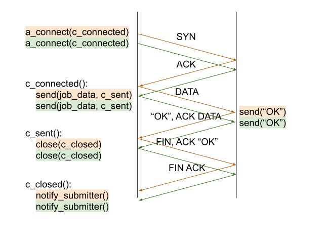
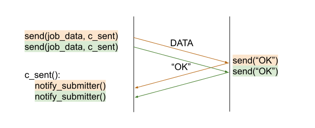

## Appendix A: Bulk Submissions

Bulk submission refers to the idea of using a minimal number of
operations to submit multiple jobs. At the user-facing API level this
would, for example, translate into the ability to call a `submit()`
method with a list/array of jobs rather than having to call it multiple
times with a single job. This is typically done for performance reasons.
Consider a simple example, in which a hypothetical `submit(job)` method
is implemented by connecting to a remote service and sending the
serialized job information. The timing diagram is:

That is, in the simplest case, with no authentication present, it takes
two round trips to submit one job, and three if one also waits for the
connection to close. Calling the `submit()` method repeatedly in a loop
results in the same process repeated serially, resulting in a total time
of `3 * rtt * n`, where `n` is the total number of jobs and `rtt` is the
round-trip time (the time it takes to send a message to the server plus
the time it takes for the reply to make it back):

A way of speeding up the process is, if the details for all the jobs in
the loop is known, to submit all the jobs at once:

where `send(job_data[])` indicates that we are now sending an array of
job information. This essentially reduces the time from `3 * rtt * n` to
`3 * rtt`, or from `O(n)` to `O(1)`. The downside is that one must know
what all the jobs in the array are at the time the `submit(job_data[])`
call is made. In practice, it is likely that a job submission API will be
driven by a workflow engine, which may not use static planning and
produce jobs individually rather than in arrays. Nonetheless, it is
possible to employ a buffer that accumulates job requests over a certain
(short) period of time and submits all the collected jobs to the API
using the bulk version of `submit()`. In essence, such an optimization
could even be performed by the job submission library, shifting some of
the complexity from the user into a reusable component.

There exist a number of alternatives to bulk submission that can improve
submission performance, which are analyzed in the following paragraphs.

#### Threaded Submission

Threaded submission involves, as the name implies, using multiple
concurrent threads to submit jobs. This can effectively divide the
submission time by the number of threads employed, as it can be seen from
the following timing diagram:

Threaded submission can, however, lose some of its advantage if any
submission steps involve CPU-bound operations, such as is the case when
initializing secure connections. A TLS handshake involves, for example,
some encryption and decryption using asymmetric cryptography. This is
usually slow, even for short messages, enough so as to limit the number
of operations to a few hundreds per second per CPU core. Since CPU cores
are time-shared between threads, only one CPU-bound operation can be
effectively executing on a given core at one time. A possible timing
diagram that assumes a single CPU core could look like this:

The extent to which cryptography is an issue in TLS is not entirely
clear. A quick performance test using `openssl s_time -connect localhost`
on decent hardware with Apache running locally returns approximately
18000 operations per second with a 2048 bit certificate and approximately
6000 operations per second with a 4096 bit certificate. Of course, this
assumes that TLS is the only CPU-bound operation relevant during
submission. A notable, if dated exception, was the concept of delegation
in Gobus GSI, which involved the generation of an asymmetric key pair.
For RSA 4096 bit keys, this is something that takes seconds on modern
hardware.

The problem of CPU-bound connection operations can be mitigated by
caching the results of such CPU-bound operations. A simple way to achieve
this is to cache the connections themselves. Alternatively, the security
layer may provide relevant functionality. For example, TLS supports
session resumption, which can be used to share cryptographic keys across
multiple connections.

#### Asynchronous Networking

Given that a large majority of the thread time in a hypothetical
`submit()` call is spent waiting for network packets to travel between
machines, converting to fully asynchronous network calls can dissociate
idle thread time on the client machine from the in-flight data delays.
This, however, requires that the submission be asynchronous; that is, the
`submit()` call must return immediately and the actual submission process
must proceed asynchronously. The rough idea is to use asynchronous
versions of networking calls, which we will denote by pre-pending the
characters `"a_"`. These calls return immediately but signal the
completion operation by calling a continuation function which is passed
by the caller in an additional parameter. For example, instead of
`connect()`, we can say `a_connect(c_connected)`, the latter being the
asynchronous version of `connect()` which calls `c_connected()` when the
connection succeeds. A possible timing diagram for submitting multiple
jobs using asynchronous networking is shown in the picture below, where
the color encodes the job with which the respective invocation is
associated:

While asynchronous networking addresses the problems imposed by network
delays, it does little to alleviate potential throttling due to CPU-bound
operations.

#### Connection Multiplexing

An alternative way of improving efficiency is to re-use a single
connection for each remote resource that jobs are submitted to. If data
is sent and received asynchronously, the timing has all the
characteristics of the asynchronous networking case while also
eliminating the need for repeated security handshakes or connection
establishment:

Connection multiplexing also comes with performance advantages. When
using individual connections to transmit short messages, TCP buffers must
be emptied before they become full, since there is simply no other data
to send over the connection. When using a single connection to transmit
larger messages, TCP buffers can be more efficiently utilized.
Additionally, it becomes feasible to tune buffer sizes in order to
optimize the throughput of connections to particular services.

