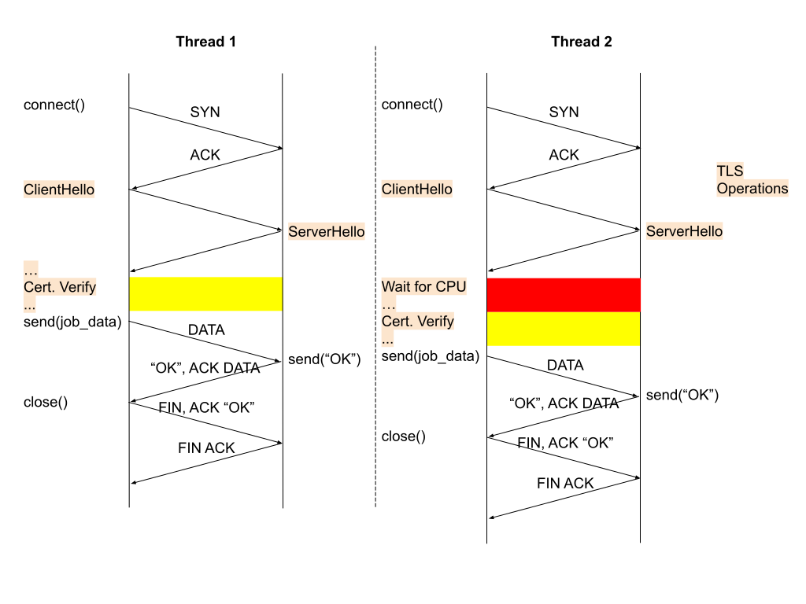
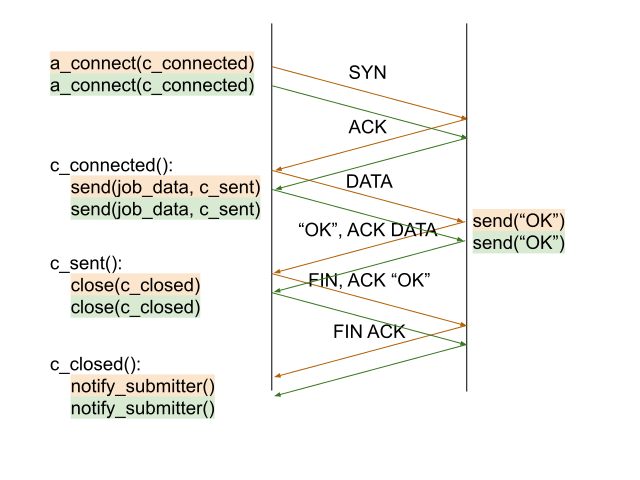
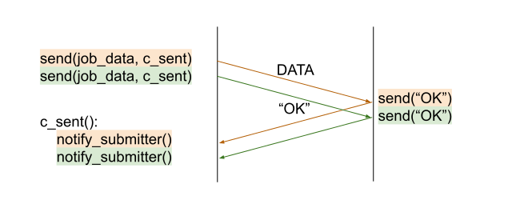

<link rel="stylesheet" href="extras.css">

# A Portable Submission Interface for Jobs (J/PSI)
*Mihael Hategan [add your name here]*

<!-- TOC depthFrom:1 depthTo:6 withLinks:1 updateOnSave:1 orderedList:0 -->

- [A Job Management API](#a-job-management-api)
	- [STATUS: EARLY DRAFT](#status-early-draft)
	- [TODO](#todo)
	- [Introduction](#introduction)
		- [A Note About Code Samples](#a-note-about-code-samples)
	- [Motivation and Design Goals](#motivation-and-design-goals)
	- [Layers](#layers)
		- [Layer 0 (local)](#layer-0-local)
		- [Layer 1 (remote)](#layer-1-remote)
		- [Layer 2 (nested)](#layer-2-nested)
	- [Interaction with LRMs and Scalability](#interaction-with-lrms-and-scalability)
	- [State Consistency](#state-consistency)
	- [The Job API; Layer 0](#the-job-api-layer-0)
		- [Implementation Notes](#implementation-notes)
		- [JobExecutor](#jobexecutor)
			- [Methods](#methods)
					- [Exceptions:](#exceptions)
		- [Job](#job)
			- [Methods](#methods)
		- [JobSpec](#jobspec)
			- [Methods](#methods)
		- [JobStatus](#jobstatus)
			- [Methods](#methods)
		- [JobState](#jobstate)
			- [Methods](#methods)
		- [JobStatusCallback](#jobstatuscallback)
			- [Methods](#methods)
		- [InvalidJobException](#invalidjobexception)
			- [Methods](#methods)
		- [InvalidJobListException](#invalidjoblistexception)
			- [Methods](#methods)
		- [FaultDetail](#faultdetail)
			- [Methods](#methods)
		- [ResourceSpec](#resourcespec)
			- [Methods](#methods)
		- [ResourceSpec](#resourcespecv1)
			- [Methods](#methods)
		- [JobAttributes](#jobattributes)
			- [Methods](#methods)
		- [TimeInterval](#timeinterval)
			- [Constructors](#constructors)
			- [Methods](#methods)
		- [TimeUnit](#timeunit)
	- [Appendices](#appendices)
		- [Appendix A - Job Spec V1 Serialization Format](#appendix-a-job-specification-v1-serialization-format)
			- [Resources](#resources)
				- [Reserved Resource Types](#reserved-resource-types)
				- [V1-Specific Resource Graph Restrictions](#v1-specific-resource-graph-restrictions)
			- [Tasks](#tasks)
			- [Attributes](#attributes)
		- [Appendix B - Synchronous vs. Asynchronous API](#appendix-b-synchronous-vs-asynchronous-api)
		- [Appendix C - Bulk Submission](#appendix-c-bulk-submission)
			- [Threaded Submission](#threaded-submission)
			- [Asynchronous Networking](#asynchronous-networking)
			- [Connection Multiplexing](#connection-multiplexing)
		- [Appendix C - examples](#appendix-c-examples)
			- [Submit and wait for N jobs](#submit-and-wait-for-n-jobs)
			- [Run N jobs while throttling to M concurrent jobs](#run-n-jobs-while-throttling-to-m-concurrent-jobs)
			- [Have N jobs compete in the queue and keep only the winner](#have-n-jobs-compete-in-the-queue-and-keep-only-the-winner)
		- [Appendix D - Naming](#appendix-d-naming)

<!-- /TOC -->

## STATUS: EARLY DRAFT


## TODO


- [ ] add examples of how one would use this API (and please, if you have
    any "how do you do x?", please add here)

    - [ ] Submit a malformed or unsatisfiable job, then check for the error
    and print it out

    - [ ] Construct a job that uses all the various "knobs" of the resource
    and job specifications (with some verbose comments thrown in)

- [ ] Consider adding further exceptions to submit() in order to
distinguish between EAGAIN types of errors and others.

- [ ] think more about env var expansion in arguments and other places.
The important issue is how much of a burden this is on implementations if
we mandate it.

- [ ] we need to go through the resource spec; many common things
supported by other JM APIs are not supported by Flux Jobspec V1, such as
queue/project/reservation, memory and/or storage requirements

- [ ] we need to discuss launchers (srun, mpirun, etc.); this is absent
from the public API and from this document entirely, but chances are that
we cannot entirely avoid this issue, so we might need to define an
abstraction over various launchers. This could, in principle, be hidden
in the adapters, but experience suggests that it's often (1)
insufficient and (2) the reason why libraries like these are hard to work
with (they never quite get the launching part right).

    - the public API need only reflect that the user could pick a
    non-default launcher by name

    - canonical implementation should have a nice way of abstracting over
    launchers

- [ ] add a section giving an overview of the API components

- [ ] add some clarification about the correspondence between JobSpec and
exec/popen.

- [ ] add some text about pilot jobs / reslicing

- [ ] Add assumptions/goals/etc.

    Things we could include in no particular order..

    - That we aim to make a minimal interface; advanced functionality is
    beyond the scope of this API

    - We would like the interface to be general and applicable to
    commonly deployed LRMs, cloud systems, etc. (I know some of this is
    said above)

    - We are focused on executing a process (e.g., popen rather than
    function call)

    - That we intend for this interface to be used by various workflow
    systems and directly by applications

    - That we base the API on lessons learned with SAGA, DRMAA, Globus,
    and others

    - Do we want to set any goals about performance/scale? Presumably we
    want ot aim to address exascale workloads and exascale machines
    (thousands of nodes)

    - We consider allocation at the unit of a single job, no intention to
    dynamically update jobs


## Introduction

The purpose of this document is to provide an analysis of the design and
implementation issues of a job management API suitable for managing jobs
that are on exascale machines, as well as propose such an API. A job
management API is a set of interfaces that allow the specification and
management of the invocation of application executables. The
corresponding implementation of a job management API is a job management
library. A job management library, through its  API,  is invoked by a
client application.

Traditionally, job management is implemented on supercomputers by Local
Resource Managers (LRMs), such as PBS/Torque, SLURM, etc. To a first
approximation, a job management API is understood as an abstraction layer
on top of various LRMs.


### A Note About Code Samples

There are various locations in this document when code is used to provide
examples. Such code is not working code, but a Java/C++/.NET inspired
pseudo-code which almost surely will require modifications to be usable.


## Motivation and Design Goals

The API is designed with a number of goals in mind. These are centered around
scalability and keeping the API and potential implementations simple. Where
trade-offs must be made, such as deciding between interface and implementation
simplicity, interface simplicity is generally favored. However, an attempt is
also made to distill and analyze the resulting complexities of a potential
implementation in order to minimize the amount of work needed to write such an
implementation.

Specifically, the following aspects have informed the design in a significant
fashion:

- The proposed API is **asynchronous**. A detailed discussion about the choice
between synchronous and asynchronous APIs can be found in
[Appendix B](#synchronous-vs-asynchronous-api). In short, the implementation of
a synchronous API would not scale well in most languages. Additionally, if so
needed, the API provides a [`waitFor()`](#job-waitfor) method that allows
client code to trivially implement a synchronous wrapper around the API.

- Bulk versions of calls have been considered. The main reason for having bulk
calls is to facilitate the use of more efficient mechanisms for
transmitting job information to an underlying implementation. However,
alternative methods exists that do not require a bulk calls. Nonetheless,
adding bulk calls to enable better performance in Layers 1-2, or even in
Layer 0 if reasonably justified in the future, remains a possibility. For
a technical discussion on the topic, please see [Appendix
C](#bulk-submission).


## Layers

There are at least three major ways in which a job management API can be
used:

- **Local**: the relevant API functions are invoked by programs running
on the target resource (or a specific node on the target resource, such
as a login/head node)

- **Remote**: the API functions are invoked by programs running on a
different resource than the target resource; this requires some form of
distributed architecture, such as a client-server model.

- **Nested** (also known as "pilot jobs"): a "pilot" job is run
using either a remote or local job management library; application jobs
are then submitted to the pilot system, which sends them directly to the
existing pilot job instances for execution, bypassing queuing
systems/LRMs. The requirements for the APIs used to submit the pilot jobs
as well as those used to run the application l and remote job management
APIs.

While the three usage scenarios share many similarities, there are subtle
differences that make the requirements for an API more complex when
remote/nested management is involved. This document specifies a layered
API in which a baseline API (Layer 0) allows for local management and
additional layers allow for more complex functionality. At a high level,
the layers are as follows:


### Layer 0 (local)

- assumes that the jobs and client application have access to a common
filesystem

- assumes that the client application is executed in an environment that
has direct access (i.e., does not require authentication) to a local LRM


### Layer 1 (remote)

- specification of remote locations

- remote capabilities:

    - a service and remote invocation protocol

    - authentication and authorization

    - encryption

- file staging

- standard output/error streaming

- file cleanup (an alternative and perhaps more flexible way of doing
this is to implement pre and post jobs in Layer 0)

- user mapping: if a system-wide service is deployed, there must be a
mapping of the authenticated user to a local user under which the job
should run


### Layer 2 (nested)

- TODO: add a statement that we intend on supporting Layer 2 in the
future, and the rough functionality will be X, Y, Z

- TBD


## Interaction with LRMs and Scalability

Implementations must use bulk status operations when interacting with
LRMs. Regularly invoking, for example, qstat for each job in a set of
many jobs can quickly overwhelm a LRM. The solution is to subscribe to
asynchronous notifications from the LRM, if supported, or instead use bulk
query interfaces (e.g.,  `qstat -a`) to get the status of all jobs and
extract the information about the relevant jobs from the result.


## State Consistency

Perhaps less relevant for Layer 0, but when dealing with concurrent
systems, ordering of events on one system cannot be guaranteed on another.
For example, an application on System 1 can, in quick succession, open a
TCP connection to System 2 and transmit, on each connection, the messages
"A" and "B", respectively. If System 2 does not serialize
connection handling (i.e., it uses separate threads for each connection),
it is entirely possible that some user code that monitors messages on
System 2 receives the message "B" before "A". In terms of jobs,
this may make it appear as if seemingly impossible things are happening,
such as a job starting to run after it has completed. Implementations
must ensure that client code does not receive events in orders that are
clearly impossible. The specifics of how this must be handled by
implementations is detailed in [`Job.getStatus()`](#job-getstatus) and
[`JobState`](#jobstate).


## The Job API; Layer 0

This section describes the basic local API.


###Implementation Notes

The API specification is to be understood as a guideline that informs the
implementation in a given language to the extent that the resulting
implementation remains conformant to the standards and practices specific
to that language. For example:

- this document uses `camelCase` for identifiers; a Python implementation
would, likely, use underscores instead

- all types in the specification are explicitly declared; an
implementation in a weakly typed language may, at its authors'
discretion, choose to implement explicit runtime type-checks, but it is
not required to do so.

- getters/setters can be replaced by properties, depending on what is
customary in the language in which the library is implemented


### JobExecutor

#### Methods


<a name="jobexecutor-getname"></a>
```java
String getName()
```

Returns the name of this executor. The name should be something simple
but sufficiently informative, such as  "SLURM", "PBS",  "Condor", or
"AWS".


<a name="jobexecutor-getversion"></a>
```java
Version getVersion()
```

Returns the version of this executor. If the system/language/standard
library in which the library is implemented provides a specific
versioning mechanism and/or versioning class, it should be used as the
`Version` class. If such a class is not provided, implementations can use
a simple string type for the version.

<a name="jobexecutor-submit"></a>
```java
void submit(Job job) throws InvalidJobException, SubmitException
```

Submits a Job to the underlying implementation. Successful return of this
method indicates that the job has been sent to the underlying
implementation and all changes in the job status, including failures,
are reported using notifications. Conversely, if one of the two possible
exceptions is thrown, then the job has not been successfully sent to the
underlying implementation, the job status remains unchanged, and no
status notifications about the job will be fired.

###### Exceptions:

- `InvalidJobException`:
    Thrown if the job specification cannot be understood. In principle,
    the underlying implementation / LRM is the entity ultimately
    responsible for interpreting a specification and reporting any errors
    associated with it. However, in many cases, this reporting may come
    after a significant delay. In the interest of failing fast, library
    implementations should make an effort of validating specifications
    early and throwing this exception as soon as possible if that
    validation fails.

- `SubmitException`: Thrown if the request cannot be sent to the underlying implementation


<a name="jobexecutor-cancel"></a>
```java
void cancel(Job job) throws SubmitException
```

Cancels a job that has been submitted to underlying executor
implementation. A successful return of this method only indicates that
the request for cancelation has been communicated to the underlying
implementation. The job will then be canceled at the discretion of the
implementation, which may be at some later time. A successful
cancelation is reflected in a change of status of the respective job to
`JobState.CANCELED`. User code can synchronously wait until the
`CANCELED` state is reached using `job.waitFor(JobState.CANCELED)` or
even `job.waitFor()`, since the latter would wait for all terminal
states, including `JobState.CANCELED`. In fact, it is recommended that
`job.waitFor()` be used because it is entirely possible for the job to
complete before the cancelation is communicated to the underlying
implementation and before the client code receives the completion
notification. In such a case, the job will never enter the `CANCELED`
state and `job.waitFor(JobState.CANCELED)` would hang indefinitely.

<a name="jobexecutor-setjobstatuscallback"></a>
```java
void setJobStatusCallback(JobStatusCallback? cb)
```

Registers a [`JobStatusCallback`](#jobstatuscallback) with this executor.
The callback will be invoked whenever a status change occurs for any of
the jobs submitted to this job executor, whether they were submitted with
an individual job status callback or not. To remove the callback, set it
to `null`.


### Job

#### State Model

Job instances are, in this API, stateful objects.  A job's state can be
inspected via the `job.getStatus()` method which will return a `JobStatus`
instance on which the job's state is available as an attribute.  State
transitions can also be received via callbacks

An implementation MUST ensure that job state transitions occur according to the
following state model:  a job is created in an initial state `NEW`.  When the
job is accepted by the backend for execution, it will enter the state `QUEUED`.
When the job is being executed and consumes resources, it enters the `ACTIVE`
state.  Upon completion, it will enter the `COMPLETED` state which is a final
state.

At any point in time (until the job is final), the job can enter the `FAILED`
state on error conditions.  That state is also reached when the job completes
execution with an error code, but can also indicate a backend error, or
a library error of any kind.  The `FAILED` state is final.

At any point in time (until the job is final), the job can enter the `CANCELED`
state as reaction to the `job.cancel()` call.  Note that the transition to
`CANCELED` is not immediate when calling that method, but the state transition
only occurs once the backend is enacting that request.  

The `ACTIVE` state is the only state where the job will consume resources.

Backend implementations are likely to have their own state definitions state and
transition semantics.  An implementation of this API MUST ensure that

  - backend states are mapped to the states defined in this document;
  - state transitions are valid with respect to the state model here defined.

An implementation MUST NOT issue state updates for any backend state transitions
which cannot be mapped to the state model.  When a backend state model misses
a representation for a state which the state model in this document requires,
the implementation MUST report the respective state transition anyway, to the
best of its knowledge.  For example, if a `JobExecutor` backend does, for some
reason, not feature a state corresponding to `QUEUED`, then the implementation
MUST issue a `QUEUED` state update between `NEW` and `ACTIVE` anyway.

Additional information (time stamps, backend details, transition triggers etc)
MAY be available on certain state transitions, in certain implementations - See
the `JobStatus` definition for additional information on such meta data.


#### Methods

<a name="job-getid"></a>
```java
String getId()
```

Returns this job's ID. The ID is assigned automatically by the
implementation when the Job object is constructed. The ID is guaranteed
to be unique on the client machine. The ID does not have to match the ID
of the underlying LRM job, but is used to identify `Job` instances as
seen by a client application.


<a name="job-setspec"></a>
```java
void setSpec(JobSpec spec)
JobSpec? getSpec()
```

Sets/retrieves the [job specification](#jobspec) for this job. A
valid job requires a non-null specification.


<a name="job-getstatus"></a>
```java
JobStatus getStatus()
```

Returns the current status of the job. It is guaranteed that the status
returned by this method is monotonic in time with respect to the partial
ordering of [JobStatus](#jobstatus) types. That is, if
`jobStatus1.getState()` and `jobStatus2.getState()` are comparable and
`jobStatus1.getState() < jobStatus2.getState()`, then it is impossible
for `jobStatus2` to be returned by a call placed prior to a call that
returns `jobStatus1` if both calls are placed from the same thread or if
a proper memory barrier is placed between the calls.
Furthermore, implementations must, to the extent possible, simulate
missing states. For example, if the implementation polls a LRM queue
infrequently enough such that the active state of a job is skipped
between two polling rounds, the job would otherwise appear to have jumped
from a `QUEUED` state to a `COMPLETED` state. However, implementations
can introduce a synthetic `ACTIVE` state change.


<a name="job-waitfor"></a>
```java
JobStatus waitFor(TimeInterval? timeout, JobState targetStates...)
```

Waits until the job reaches either of the `targetStates` or until an
amount of time indicated by the timeout parameter passes. Returns the
[JobStatus](#jobstatus) object that has one of the desired `targetStates`
or `null` if the timeout is reached.

```java
JobStatus waitFor(JobState targetStates...)
```

Equivalent to `waitFor(null, targetStates)`.

```java
JobStatus waitFor(TimeInterval? timeout)
```

Waits for the job to complete for a certain amount of time, or
indefinitely if `timeout` is `null`. Returns a [JobStatus](#jobstatus)
object that represents the status of the job at termination or `null` if
the timeout is reached. Equivalent to `waitFor(timeout,
JobState.COMPLETED, JobState.FAILED, JobState.CANCELED)`.

```java
JobStatus waitFor()
```

Equivalent to `waitFor(null)`, which waits indefinitely for the job to
complete.


<a name="job-setstatuscallback"></a>
```java
void setStatusCallback(JobStatusCallback? cb)
```

Sets a [status callback](#jobstatuscallback) for this job. The callback
will be invoked when the state of this job changes. To unset the
callback, call this method with a `null` argument.


### JobSpec

#### Methods


<a name="jobspec-setname"></a>
```java
void setName(String name)
String? getName()
```

Sets/retrieves a name for the job. The name plays no functional role.
However, it can help users in tracking the job across various layers.
Implementations should make an effort to propagate the name so that the
user can quickly identify the job as it propagates through the system.
For example, the job should appear with this name in the output of a
potential `qstat` LRM command.


<a name="jobspec-setdirectory"></a>
```java
void setDirectory(Path directory)
Path? getDirectory()
```

Sets/gets the directory that will be the *current working directory* of
the job immediately after starting. The path must either be an absolute
directory or start with `"~/"`, in which case it indicates a path
relative to the user's home directory on the machine that the job runs.
If no directory is specified for a job, implementations are free to
choose a default working directory for the job. However, clients should
note that such a default working directory will not necessarily be
writable. Clients should also note that directories valid on the submit
side are not necessarily valid on the machine that runs the job.


<a name="jobspec-setexecutable"></a>
```java
void setExecutable(Path executable)
Path? getExecutable()
```

Sets/gets the path to the executable file to be launched. A relative path
is considered relative to the job directory (if specified, or the default
job directory, as indicated in the description of
[setDirectory()](#jobspec-setdirectory)).


<a name="jobspec-setarguments"></a>
```java
void setArguments(List<String> arguments)
List<String>? getArguments()
```

Sets/gets the argument list to be passed to the executable. Unlike with
`execve()`, the first element of the list will correspond to `argv[1]`
when accessed by the invoked executable. If no previous call to
`setArguments` was made, `getArguments` will return `null`. The setter
does not create a copy of the list. Therefore, it is possible to add
arguments to the list by invoking `setArguments()` with a mutable list,
then invoking `getArguments().add()`.


<a name="jobspec-setoverrideenvironment"></a>
```java
void setOverrideEnvironment(boolean clearEnvironment)
boolean getOverrideEnvironment()
```

If this flag is set to `false`, the job starts with an empty environment.
The only environment variables that will be accessible to the job are the
ones set using `setEnvironment()`. If this flag is set to `true`, which
is the default, the job will also have access to inherited environment
variables. The precise nature of the inherited environment is left to the
implementation. In principle, this functionality is meant to allow
computing resources to pass various information to executing
applications, such as the location of a scratch directory in `$SCRATCH`,
while still allowing clients to define unrelated environment variables.


<a name="jobspec-setenvironment"></a>
```java
void setEnvironment(Map<String, String> environment)
Map<String, String>? getEnvironment()
```

Sets/gets the environment for the job. The environment is a mapping of
environment variable names to their respective values. The getter returns
`null` if no previous call to `setEnvironment()` was made.
Implementations must honor simple variable substitution for the values,
using the *Bash* brace syntax: `${VARIABLE_NAME}`. This is useful for
extending path lists, such as `PATH` or `LD_LIBRARY_PATH`. The setter
stores the map as passed by client code and does not make a copy of it.


<a name="jobspec-setstdinpath"></a>
<a name="jobspec-setstdoutpath"></a>
<a name="jobspec-setstderrpath"></a>
```java
void setStdinPath(Path stdin)
Path? getStdinPath()
void setStdoutPath(Path stdout)
Path? getStdoutPath()
void setStderrPath(Path stderr)
Path? getStderrPath()
```

Set/get the paths to the standard stream files.


<a name="jobspec-setresources"></a>
```java
void setResources(ResourceSpec resources)
ResourceSpec? getResources()
```

Gets/sets the [resource requirements](#resourcespec) of this job. The
resource requirements specify the details of how the job is to be run on
a cluster, such as the number and type of compute nodes used, etc.


<a name="jobspec-setattributes"></a>
```java
void setAttributes(JobAttributes attributes)
JobAttributes getAttributes()
```

Gets/sets the [job attributes](#jobattributes). Job attributes are
details about the job, such as the walltime, that are descriptive of how
the job behaves. Attributes are, in principle, non-essential in that the
job could run even though no attributes are specified. In practice,
specifying a walltime is often necessary to prevent LRMs from prematurely
terminating a job.


### JobStatus

#### Methods


<a name="jobstatus-getstate"></a>
```java
JobState getState()
```

Return the state of the job.


<a name="jobstatus-gettime"></a> ```java Timestamp getTime() ``` Returns
the time at which the job has entered this state. The `Timestamp` class
is expected to be provided by the standard library of the language in
which the library is implemented. If such a class is not provided,
implementations have the discretion of implementing a relevant
`Timestamp` class.


<a name="jobstatus-getmetdadata"></a>
```java
Dictionary<String, Object>? getMetadata()
```

Returns metadata associated with this status, if any. The content of the
metadata dictionary is not mandated by this specification and is left to the
implementation. Possible metadata entries include:

* `native-id`: the native identifier used by the LRM for the job.


<a name="jobstatus-getexitcode"></a>
```java
int? getExitCode()
```

If the job has exited, returns the exit code, otherwise `null`.


<a name="jobstatus-getmessage"></a>
```java
String? getMessage()
```

Returns the message associated with this status, if any.


<a name="jobstatus-isfinal"></a>
```java
boolean isFinal()
```

A convenience wrapper for
[`status.getState().isFinal()`](#jobstate-isFinal).


### JobState

An enumeration holding the possible job states, which are: `NEW`,
`QUEUED`, `ACTIVE`, `COMPLETED`, `FAILED`, and `CANCELED`.

#### Methods

<a name="jobstate-isgreaterthan"></a>
```java
boolean isGreaterThan(JobState other)
```

Defines a partial ordering on the states. It is not possible to compare two
final states -- otherwise all state pairs are comparable. Comparisons are
transitive.  The order is:

  - `QUEUED    > NEW`
  - `ACTIVE    > QUEUED`
  - `COMPLETED > ACTIVE`
  - `FAILED    > ACTIVE`
  - `CANCELLED > ACTIVE`

The relevance of the partial ordering is that the system guarantees that
no transition that would violate this ordering can occur. For example, no
job can go from `COMPLETED` to `QUEUED` because `COMPLETED > ACTIVE >
QUEUED`, therefore `COMPLETED > QUEUED`.

An implementation must ensure that state update notifications are delivered in
order and without missing intermediate states.


<a name="jobstate-isfinal"></a>
```java
boolean isFinal()
```

Returns `true` if a job cannot further change state once this state is
reached. The final states are `COMPLETED`, `FAILED`, and `CANCELED`.


### JobStatusCallback

An interface used to listen to job status change events.

#### Methods

<a name="jobstatuscallback-jobstatuschanged"></a>
```java
void  jobStatusChanged(Job job, JobStatus status)
```

Client code interested in receiving notifications must implement this
method. The parameters are the job whose status has changed and the new
status. One should note that it is entirely possible that calling
[`job.getStatus()`](#job-getstatus) from the body of this method would
return something different from the status passed to this callback. This
is because the status of the job can be updated during the execution of
the body of this method and, in particular, before the potential call to
`job.getStatus()` is made.

Client code implementing this method must return quickly and cannot be
used for lengthy processing.


### InvalidJobException

#### Methods

<a name="invalidjobexception-getdetail"></a>
```java
FaultDetail getDetail()
```

Returns the details about the failure.

<a name="invalidjobexception-getmessage"></a>
```java
String getMessage()
```

Retrieves the message associated with this exception. This should be a
descriptive message that is sufficiently clear to be presented to an
end-user.


<a name="invalidjobexception-getexception"></a>
```java
Exception? getException()
```

Returns an optional underlying exception that can potentially be used for
debugging purposes, but which should not, in general, be presented to an
end-user.


<a name="invalidjobexception-getjob"></a>
```java
Job getJob()
```

Returns the [`Job`](#job) associated with this exception.


### ResourceSpec

The `ResourceSpec` class is a base abstract class that describes job
resource requirements. The current defined subclasses are:
[`ResourceSpec`](#resourcespecv1).

#### Methods

```java
int getVersion()
```

Returns the version of the class implementing the resource specification.
For example, `ResourceSpec.getVersion()` would return `1`.


### ResourceSpec

This class represents the simplest resource specification available. It
assumes that jobs and resources are homogeneous.

#### Methods

<a name="resourcespecv1-setnodecount"></a>
```java
void setNodeCount(int nodeCount)
int? getNodeCount()
```

Sets/gets the node count. If specified, allocate this number of nodes for
the job. Alternatively, one may specify the `processCount` instead and
let the LRM allocate the necessary number of nodes according to local
policies. Specifying both the `nodeCount` and the `processCount` is not
allowed.


<a name="resourcespecv1-setexclusivenodeuse"></a>
```java
void setExclusiveNodeUse(boolean exclusiveNodeUse)
boolean? getExclusiveNodeUse()
```

Specifies whether nodes can be shared with other jobs, possibly belonging
to other users, or if nodes should be allocated exclusively for this job.


<a name="resourcespecv1-setprocesscount"></a>
```java
void setProcessCount(int processCount)
int? getProcessCount()
```

Gets/sets the total process count. If specified, run this many parallel
instances of the job process. This instructs the LRM to allocate nodes as
needed. This property and `nodeCount` are mutually exclusive.


<a name="resourcespecv1-setprocessespernode"></a>
```java
void setProcessesPerNode(int processesPerNode)
int getProcessesPerNode()
```

If the `nodeCount` is specified, this property instructs the LRM to run
this many processes on each node. This property defaults to `1`.


<a name="resourcespecv1-setcpucoresperprocess"></a>
```java
void setCPUCoresPerProcess(int cpuCoresPerProcess)
int? getCPUCoresPerProcess()
```

Sets the number of cores that each process needs. This property is used
by the underlying implementation to compute the number of nodes needed
from the number of processes requested and the number of cores available
on each node. Specifically, `nodeCount = processCount * cpuCoresPerNode /
cpuCoresPerProcess`, where `cpuCoresPerNode` is the number of CPU cores
each node has and is a property of the cluster.


<a name="resourcespecv1-setgpucoresperprocess"></a>
```java
void setGPUCoresPerProcess(int gpuCoresPerProcess)
int? getGPUCoresPerProcess()
```

Similar to `cpuCoresPerProcess`, except for GPU cores. For heterogeneous
clusters, with GPUs available only on some nodes, setting this property
signifies to the LRM that GPU nodes are being requested.


### JobAttributes

#### Methods

<a name="jobattributes-setduration"></a>
```java
void setDuration(TimeInterval duration)
TimeInterval? getDuration()
```

Sets/gets the duration of the job. If not specified, a duration of 10
minutes is assumed. Implementations are not required to implement better
than second resolution for the time interval and LRMs often have minute
resolutions for job durations.


<a name="jobattributes-setqueuename"></a>
```java
void setQueueName(String queueName)
String? getQueueName()
```

Sets/gets the queue name representing the LRM queue that the job is to be
submitted to. If no queue is specified, the implementation or LRM may
either choose a default queue or throw an
[`InvalidJobException`](#invalidjobexception).


<a name="jobattributes-setprojectname"></a>
```java
void setProjectName(String projectName)
String? getProjectName()
```

Sets/gets a project name. It is common for local LRM policies to use
projects to allow structured billing of CPU-hours. If no project is
specified, the implementation or LRM may either choose a default project
or throw an [`InvalidJobException`](#invalidjobexception).


<a name="jobattributes-setreservationid"></a>
```java
void setReservationId(String reservationId)
String? getReservationId()
```

Sets/get a reservation ID for the job. Many LRMs allow making advanced
reservations, which pre-allocate a block of nodes to be used by a project
during a certain time interval. Jobs submitted to the pre-allocated nodes
do not wait in the queue and are, instead, started as soon as possible.
Advanced reservations are typically represented by an ID. Specifying this
property indicates that the job should be submitted to the block of
resources reserved through the advanced reservation represented by this
ID.


<a name="jobattributes-setcustomattribute"></a>
```java
void setCustomAttribute(String name, Object value);
Object? getCustomAttribute(String name);
```

Allows setting/querying of custom attributes. Implementations are
encouraged to make sensible decisions on whether to store some or all of
the fixed attributes in the same structure as the custom attributes or
not. It is, therefore, entirely possible for
`getCustomAttribute("duration")` to return a value passed earlier to
`setDuration()`, although the specific custom attribute name need not be
`"duration"`.

### TimeInterval

A class that allows users to specify a time interval in various formats.
Implementations are encouraged to use standard library classes if
available instead of re-implementing a custom `TimeInterval` class. If
standard library classes are not available to represent time intervals
and a `TimeInterval` class is implemented, it should, at a minimum,
implement the following methods:

#### Constructors

```java
TimeInterval(int n, TimeUnit unit)
```

Constructs a time interval having a duration of `n * unit`, where `unit`
is a unit of time as specified by the [`TimeUnit`](#timeunit) class.


```java
TimeInterval(int hh, int mm, int ss)
```

Constructs a time interval having the duration of `hh` hours, `mm`
minutes, and `ss` seconds.


#### Methods

<a name="timeinterval-toseconds"></a>
```java
int toSeconds()
```

Returns the duration of this interval in seconds, rounded up to the
nearest integer value.


### TimeUnit

Represents a time unit and must have at least the following units:
`SECOND`, `MINUTE`, `HOUR`.


## Appendices

### Appendix A - Job Specification V1 Serialization Format

A domain specific language based on YAML is defined to express the
resource requirements and other attributes of one or more programs
submitted for execution. This describes the version 1 of the job
specification, which represents a request to run exactly one program.
This version is based heavily on [Flux's Jobspec
V1](https://flux-framework.readthedocs.io/projects/flux-rfc/en/latest/spec_25.html),
which is itself a simplified version of the [canonical Flux jobspec
format](https://flux-framework.readthedocs.io/projects/flux-rfc/en/latest/spec_14.html).

A job specification V1 YAML document SHALL consist of a dictionary defining the
resources, tasks and other attributes of a single program. The dictionary
MUST contain the keys `resources`, `tasks`, `attributes`, and `version`.
Each of the listed job specification keys SHALL meet the form and requirements
listed in detail in the sections below.

#### Resources

The value of the resources key SHALL be a strict list which MUST define
either node or slot as the first and only resource. Each list element
SHALL represent a **resource vertex** (described below).

A resource vertex SHALL contain only the following keys:

**type**

The `type` key for a resource SHALL indicate the type of resource to be
matched. In V1, only four resource types are valid: `[node, slot, core,
and gpu]`. `slot` types are described in the **Reserved Resource Types**
section below.

**count**

The `count` key SHALL indicate the desired number of resources matching
the current vertex. The `count` SHALL be a single integer value
representing a fixed count

A resource vertex MAY additionally contain one or more of the following
keys:


**with**

The `with` key SHALL indicate an edge of type out from this resource
vertex to another resource. Therefore, the value of the `with` key SHALL
be a dictionary conforming to the resource vertex specification.

**label**

The `label` key SHALL be a string that may be used to reference this
resource vertex from other locations within the same job specification. `label`
SHALL be local to the namespace of the current job specification, and each label
in the current job specification must be unique. `label` SHALL be mandatory in
resource vertices of type `slot`.

##### Reserved Resource Types

**slot**

A resource type of `type: slot` SHALL indicate a grouping of resources
into a named task slot. A `slot` SHALL be a valid resource specification
including a `label` key, the value of which may be used to reference the
named task slot during tasks definition. The `label` provided SHALL be local
to the namespace of the current job specification.

A task slot SHALL have at least one edge specified using `with`:, and the
resources associated with a slot SHALL be exclusively allocated to the
program described in the job specification.

##### V1-Specific Resource Graph Restrictions

In V1, the `resources` list MUST contain exactly one element, which MUST
be either `node` or `slot`. Additionally, the resource graph MUST contain
the `core` type.

In V1, there are also restrictions on which resources can have `out`
edges to other resources. Specifically, a `node` can have an out edge to
a `slot`, and a `slot` can have an out edge to a `core`. If a `slot` has
an out edge to a `core`, it can also, optionally, have an out edge to a
`gpu` as well. Therefore, the complete enumeration of valid resource
graphs in V1 is:

- slot>core

- node>slot>core

- slot>(core,gpu)

- node>slot>(core,gpu)


#### Tasks

The value of the `tasks` key SHALL be a strict list which MUST define
exactly one task. The list element SHALL be a dictionary representing a
task to run as part of the program. A task descriptor SHALL contain the
following keys:

**command**

The value of the `command` key SHALL be a list representing an executable
and its arguments.


**slot**

The value of the `slot` key SHALL match a `label` of a resource vertex of
type `slot`. It is used to indicate the **task slot** on which this task
or tasks shall be contained and executed. The number of tasks executed
per task slot SHALL be a function of the number of resource slots and
total number of tasks requested to execute.


**count**

The value of the `count` key SHALL be a dictionary supporting at least
the keys `per_slot` and `total`, with other keys reserved for future or
site-specific extensions.

 - **per_slot**

   The value of `per_slot` SHALL be a number indicating the number of
   tasks to execute per task slot allocated to the program.

 - **total**

   The value of the `total` field SHALL indicate the total number of
   tasks to be run across all task slots, possibly oversubscribed.


#### Attributes

The value of the `attributes` key SHALL be a dictionary of dictionaries.
The `attributes` dictionary MAY contain one or both of the following keys
which, if present, must have values. Values MAY have any valid YAML type.


**user**

Attributes in the user dictionary are unrestricted, and may be used as
the application demands.


**system**

Attributes in the `system` dictionary are additional parameters that
affect program execution, scheduling, etc. All attributes in `system` are
reserved words, however unrecognized words SHALL trigger no more than a
warning. This permits job specification reuse between schedulers which may be
configured differently and recognize different sets of attributes.

Most system attributes are optional. Schedulers SHALL provide reasonable
defaults for any system attributes that they recognize when at all
possible. Most system attributes are optional, but the duration attribute
is required in job specification V1.

Some common system attributes are:

**duration**

The value of the `duration` attribute is a floating-point number greater
than or equal to zero representing time span in seconds. A duration of 0
SHALL be interpreted as "unlimited" or "not set" by the system.
The scheduler will make an effort to allocate the requested resources for
the number of seconds specified in `duration`.


**environment**

The value of the `environment` attribute is a dictionary containing the
names and values of environment variables that should be set (or unset)
when spawning tasks. For each entry in the `environment` dictionary, the
key is a string representing the environment variable name and the value
is a string representing the environment variable value to set. A null
value represents unsetting the environment variable given by key.


**cwd**

The value of the `cwd` attribute is a string containing the absolute path
to the current working directory to use when spawning the task.


**job**

The `job` attribute is an optional dictionary containing job metadata.
This metadata may be used for searching and filtering of jobs. Every
value in the dictionary must be a string. The application is free to
create keys of any name, however the following are reserved for special
use:

  - **name**

    The name key contains the name of the job. The default name of a job
    is the first argument of the command run by the user, or it can be
    set by the user to an arbitrary value.

### Appendix B - Synchronous vs. Asynchronous API

Running a job synchronously means that a hypothetical `run()` call does not
return until the job completes. The typical scenario in which a job management
API would be used involves jobs that are launched on a client machine (e.g.,
login node), but whose CPU-bound part would run on a different machine (e.g.,
compute node). This implies that the fundamental operations that comprise
`job.run()` are some initial submission steps that communicate the details of
the job from the client machine to the compute node and start the relevant
CPU-bound code on the compute node as well as a step that waits for the
CPU-bound code to finish executing:

```java
run() {
    submit();
    waitForCompletion();
}
```

Considering jobs with non-trivial run durations, the bulk of the time in the
above simplified definition of `run()` would be spent in `waitForCompletion()`,
which is an operation that, if implemented as efficiently as possible, would
consume no CPU time locally during the execution of the job. However, it holds
the non-CPU resources associated with the thread that invokes it, namely kernel
and stack memory. Any jobs running concurrently would, each, hold the resources
associated with each of their respective threads. By contrast, an asynchronous
implementation can run multiple jobs in a single thread:

```java
void runJobs() {
    jobsLeft = alljobs.size();
    executor.addJobStatusCallback(new JobStatusCallback() {
        jobStatusChanged(Job job, JobStatus status) {
            if (status.isTerminal()) {
                jobsLeft--;
            }
        }
    });
    for (job in alljobs) {
        executor.submit(job);
    }
    // all jobs are now running
    while (jobsLeft > 0) {
        Thread.sleep(someDelay);
    }
}
```

Changing between an asynchronous interface and a synchronous one is a
relatively simple matter. For example, running a job synchronously on top
of an asynchronous API can be done as follows:

```java
void runJob(Job job, JobExecutor executor) {
    condition = new Condition();
    callback =
    executor.submit(job, new JobStatusCallback() {
        void jobStatusChanged(Job job, JobStatus status) {
            if (status.isTerminal()) {
                condition.signal();
            }
        }
    });
    condition.await();
}
```

The converse, wrapping a synchronous API with an asynchronous interface
is also straightforward:

```java
void submit(Job job, JobExecutor executor, JobStatusCallback cb) {
    new Thread() {
        run() {
            executor.run(job);
            cb.jobStatusChanged(job, ....);
        }
    }.start()
}
```

There are, however, subtle issues that ultimately make the two approaches
inequivalent:

- a synchronous API must have some asynchronous status notifications if
it is to allow timely propagation of events that are not strictly part of
the overall job lifetime, such as, transitioning from a queued state to a
running state when run by a queuing LRM;

- an asynchronous translation layer on top of a synchronous API still
suffers from the aforementioned wasted thread memory issue.

In light of the above, one might conclude that a scalable API would start
with an asynchronous API and optionally add convenience synchronous
methods.


### Appendix C - Bulk Submission

Bulk submission refers to the idea of using a minimal number of
operations to submit multiple jobs. At the user-facing API level this
would, for example, translate into the ability to call a `submit()`
method with a list/array of jobs rather than having to call it multiple
times with a single job. This is typically done for performance reasons.
Consider a simple example, in which a hypothetical `submit(job)` method
is implemented by connecting to a remote service and sending the
serialized job information. The timing diagram is:


That is, in the simplest case, with no authentication present, it takes
two round trips to submit one job, and three if one also waits for the
connection to close. Calling the `submit()` method repeatedly in a loop
results in the same process repeated serially, resulting in a total time
of `3 * rtt * n`, where `n` is the total number of jobs and `rtt` is the
round-trip time (the time it takes to send a message to the server plus
the time it takes for the reply to make it back):


A way of speeding up the process is, if the details for all the jobs in
the loop is known, to submit all the jobs at once:


where `send(job_data[])` indicates that we are now sending an array of
job information. This essentially reduces the time from `3 * rtt * n` to
`3 * rtt`, or from `O(n)` to `O(1)`. The downside is that one must know
what all the jobs in the array are at the time the `submit(job_data[])`
call is made. In practice, it is likely that a job submission API will be
driven by a workflow engine, which may not use static planning and
produce jobs individually rather than in arrays. Nonetheless, it is
possible to employ a buffer that accumulates job requests over a certain
(short) period of time and submits all the collected jobs to the API
using the bulk version of `submit()`. In essence, such an optimization
could even be performed by the job submission library, shifting some of
the complexity from the user into a reusable component.

There exist a number of alternatives to bulk submission that can improve
submission performance, which are analyzed in the following paragraphs.


#### Threaded Submission

Threaded submission involves, as the name implies, using multiple
concurrent threads to submit jobs. This can effectively divide the
submission time by the number of threads employed, as can be seen in
the following timing diagram:


Threaded submission can, however, lose some of its advantage if any
submission steps involve CPU-bound operations, such as is the case when
initializing secure connections. A TLS handshake involves, for example,
some encryption and decryption using asymmetric cryptography. This is
usually slow enough, even for short messages, so as to limit the number
of operations to a few hundreds per second per CPU core. Since CPU cores
are time-shared between threads, only one CPU-bound operation can be
effectively executing on a given core at one time. A possible timing
diagram that assumes a single CPU core could look like this:



The extent to which cryptography is an issue in TLS is not entirely
clear. A quick performance test using `openssl s_time -connect localhost`
on decent hardware with Apache running locally returns approximately
18000 operations per second with a 2048-bit certificate and approximately
6000 operations per second with a 4096-bit certificate. Of course, this
assumes that TLS is the only CPU-bound operation relevant during
submission. A notable, if dated exception, was the concept of delegation
in Globus GSI, which involved the generation of an asymmetric key pair.
For RSA 4096-bit keys, this is something that takes seconds on modern
hardware.

The problem of CPU-bound connection operations can be mitigated by
caching the results of such CPU-bound operations. A simple way to achieve
this is to cache the connections themselves. Alternatively, the security
layer may provide relevant functionality. For example, TLS supports
session resumption, which can be used to share cryptographic keys across
multiple connections.


#### Asynchronous Networking

Given that a large majority of the thread time in a hypothetical
`submit()` call is spent waiting for network packets to travel between
machines, converting to fully asynchronous network calls can dissociate
idle thread time on the client machine from the in-flight data delays.
This, however, requires that the submission be asynchronous; that is, the
`submit()` call must return immediately and the actual submission process
must proceed asynchronously. The rough idea is to use asynchronous
versions of networking calls, which we will denote by pre-pending the
characters `"a_"`. These calls return immediately but signal the
completion operation by calling a continuation function which is passed
by the caller in an additional parameter. For example, instead of
`connect()`, we can say `a_connect(c_connected)`, the latter being the
asynchronous version of `connect()` which calls `c_connected()` when the
connection succeeds. A possible timing diagram for submitting multiple
jobs using asynchronous networking is shown in the picture below, where
the color encodes the job with which the respective invocation is
associated:




While asynchronous networking addresses the problems imposed by network
delays, it does little to alleviate potential throttling due to CPU-bound
operations.


#### Connection Multiplexing

An alternative way of improving efficiency is to re-use a single
connection for each remote resource that jobs are submitted to. If data
is sent and received asynchronously, the timing has all the
characteristics of the asynchronous networking case while also
eliminating the need for repeated security handshakes or connection
establishment:



Connection multiplexing also comes with performance advantages. When
using individual connections to transmit short messages, TCP buffers must
be emptied before they become full, since there is simply no other data
to send over the connection. When using a single connection to transmit
larger messages, TCP buffers can be more efficiently utilized.
Additionally, it becomes feasible to tune buffer sizes in order to
optimize the throughput of connections to particular services.


### Appendix C - examples

This Appendix contains some examples of how the API can be used. Unlike the
specification language, the examples are in a hypothetical Python binding, which
is expected to be a relatively frequently used binding.

#### Submit and wait for N jobs

This example shows how to submit `N` jobs and synchronously wait for them to
complete.

```python
import jpsi

jex = jpsi.JobExectorFactory.get_instance('slurm')

def make_job():
    job = jpsi.Job()
    spec = jpsi.JobSpec()
    spec.executable = '/bin/sleep'
    spec.arguments = ['10']
    job.specification = spec
    return job

jobs = []
for i in range(N):
    job = make_job()
    jobs.append(job)
    jex.submit(job)

for i in range(N):
    jobs[i].wait_for()
```


#### Run N jobs while throttling to M concurrent jobs

This example shows how to run a total of `N` jobs while ensuring that at most
`M` are running in parallel at any given time. It uses the callback mechanism of
the [JobExecutor class](#jobexecutor) to submit more jobs as previously
submitted jobs complete in order to keep the running number of jobs at `M`.

```python
import jpsi

class ThrottledSubmitter:
    def __init__(self):
        self.jex = jpsi.JobExecutorFactory.get_instance('torque', '>= 0.2')
        # keep track of completed jobs so that we can submit the rest
        self.jex.set_status_callback(self.callback)
        self.crt = 0

    def make_job(self):
        ...

    def submit_next():
        if self.crt < N:
            jex.submit(self.jobs[self.crt])
            self.crt += 1

    def start(self)
        # create list of jobs
        self.jobs = [self.make_job() for i in range(N)]

        # submit initial M jobs
        while self.crt < M:
            submit_next()

    def callback(self, job, status):
        if status.final:
            # a previously submitted job is now done, we have room to
            # submit another
            self.submit_next()

ThrottleSubmitter().start()
```


### Appendix D - Naming

The Portable Submission Interface for Jobs (J/PSI) is named after the [J/ψ
meson](https://en.wikipedia.org/wiki/J/psi_meson).  It is pronounced like
"Jay-Sigh" (or ˈdʒeɪ ˈsaɪ if you know
[IPA](https://en.wikipedia.org/wiki/Help:IPA/English)).
