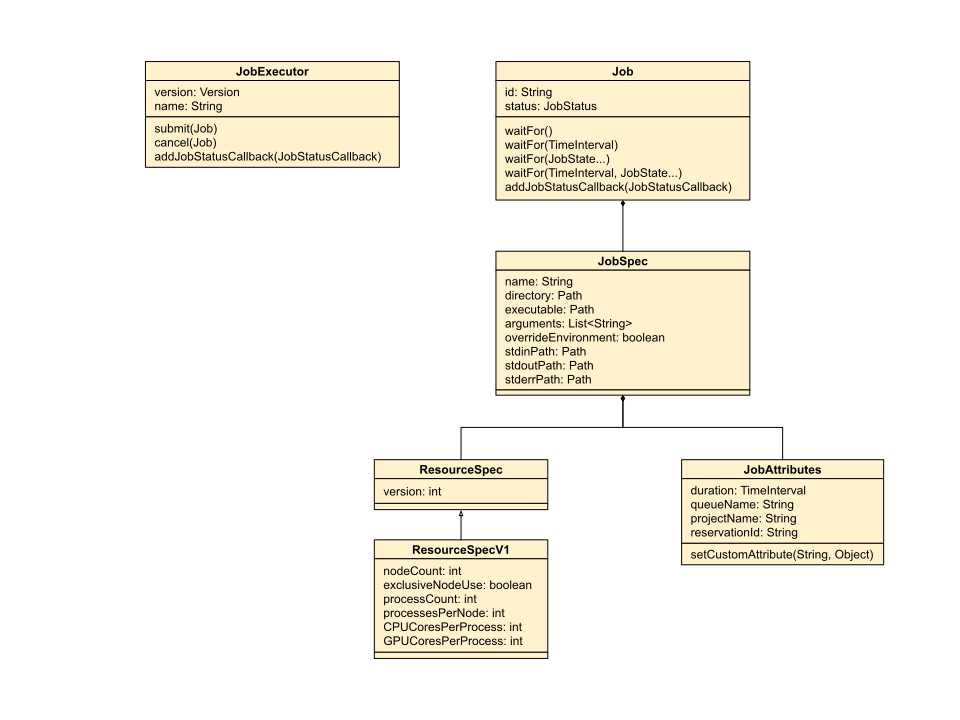

<link rel="stylesheet" href="extras.css">
<script
  src="https://code.jquery.com/jquery-3.5.1.min.js"
  integrity="sha256-9/aliU8dGd2tb6OSsuzixeV4y/faTqgFtohetphbbj0="
  crossorigin="anonymous"></script>

<script src="extras.js"></script>

# A Portable Submission Interface for Jobs (PSI/J)
*James Corbett, Mihael Hategan, Stephen Herbein, Andre Merzky*

<!-- TOC depthFrom:1 depthTo:6 withLinks:1 updateOnSave:1 orderedList:0 -->


- [A Portable Submission Interface for Jobs (PSI/J)](#a-portable-submission-interface-for-jobs-psij)
  - [STATUS: EARLY DRAFT](#status-early-draft)
  - [Introduction](#introduction)
    - [A Note about Code Samples](#a-note-about-code-samples)
  - [Motivation and Design Goals](#motivation-and-design-goals)
  - [Layers](#layers)
    - [Layer 0 (local)](#layer-0-local)
    - [Layer 1 (remote)](#layer-1-remote)
    - [Layer 2 (nested)](#layer-2-nested)
  - [The Job API; Layer 0](#the-job-api-layer-0)
    - [Implementation Notes](#implementation-notes)
      - [Interaction with LRMs and Scalability](#interaction-with-lrms-and-scalability)
    - [JobExecutor](#jobexecutor)
      - [Methods](#methods)
        - [Exceptions](#exceptions)
    - [Job](#job)
      - [State Model](#state-model)
      - [Constructors](#constructors)
      - [Methods](#methods-1)
    - [JobSpec](#jobspec)
      - [Constructors](#constructors-1)
      - [Methods](#methods-2)
    - [JobStatus](#jobstatus)
      - [Constructors](#constructors-2)
      - [Methods](#methods-3)
    - [JobState](#jobstate)
      - [Constructors](#constructors-3)
      - [Methods](#methods-4)
    - [JobStatusCallback](#jobstatuscallback)
      - [Constructors](#constructors-4)
      - [Methods](#methods-5)
    - [InvalidJobException](#invalidjobexception)
      - [Constructors](#constructors-5)
      - [Methods](#methods-6)
    - [SubmitException](#submitexception)
      - [Constructors](#constructors-6)
      - [Methods](#methods-7)
    - [UnreachableStateException](#unreachablestateexception)
      - [Constructors](#constructors-7)
      - [Methods](#methods-8)
    - [ResourceSpec](#resourcespec)
      - [Constructors](#constructors-8)
      - [Methods](#methods-9)
    - [ResourceSpecV1](#resourcespecv1)
      - [Constructors](#constructors-9)
      - [Methods](#methods-10)
    - [JobAttributes](#jobattributes)
      - [Constructors](#constructors-10)
      - [Methods](#methods-11)
    - [TimeInterval](#timeinterval)
      - [Constructors](#constructors-11)
      - [Methods](#methods-12)
    - [TimeUnit](#timeunit)
    - [Path](#path)
  - [Appendices](#appendices)
    - [Appendix A - Synchronous vs. Asynchronous API](#appendix-a---synchronous-vs-asynchronous-api)
    - [Appendix B - Bulk Submission](#appendix-b---bulk-submission)
      - [Threaded Submission](#threaded-submission)
      - [Asynchronous Networking](#asynchronous-networking)
      - [Connection Multiplexing](#connection-multiplexing)
    - [Appendix C - Examples](#appendix-c---examples)
      - [Submit and Wait for N Jobs](#submit-and-wait-for-n-jobs)
      - [Run N Jobs while Throttling to M Concurrent Jobs](#run-n-jobs-while-throttling-to-m-concurrent-jobs)
      - [Submit a Malformed or Unsatisfiable Job](#submit-a-malformed-or-unsatisfiable-job)
      - [Submit a Job, Wait for Queued Event, Cancel, and Then Wait for the Final Event](#submit-a-job-wait-for-queued-event-cancel-and-then-wait-for-the-final-event)
      - [Run a Job with P Total Processes where Each Process Gets C CPUs and G GPUs](#run-a-job-with-p-total-processes-where-each-process-gets-c-cpus-and-g-gpus)
      - [N Exclusive Nodes, Each with P Processes](#n-exclusive-nodes-each-with-p-processes)
      - [Construct a Job that Uses All the Various “Knobs” of the Resource and Job Specifications](#construct-a-job-that-uses-all-the-various-knobs-of-the-resource-and-job-specifications)
      - [Submit a Job, Check for a Transient Error, Retry if One Occurred](#submit-a-job-check-for-a-transient-error-retry-if-one-occurred)
    - [Appendix D - Naming](#appendix-d---naming)

<!-- /TOC -->

## STATUS: EARLY DRAFT


## Introduction

The purpose of this document is to provide an analysis of the design and
implementation issues of a job management API suitable for managing jobs on 
exascale machines. A job management API is a set of interfaces that allow the 
specification and management of the invocation of application executables. The
corresponding implementation of a job management API is a job management
library. A job management library, through its  API,  is invoked by a client 
application.

Traditionally, job management is implemented on supercomputers by local
resource managers (LRMs), such as PBS/Torque, Slurm, etc. To a first 
approximation, a job management API can be understood as an abstraction layer
on top of various LRMs.

Job management is sometimes also provided by execution managers, with
capabilities similar to LRMs but operating in user space on a limited subset of 
resources such as within a job's allocation.  This job management API aims to 
also transparently abstract such execution managers.


### A Note about Code Samples

There are various locations in this document where code is used to provide
examples. Such code is not working code, but a Java/C++/.NET inspired
pseudo-code which almost surely will require modifications to be usable.


## Motivation and Design Goals

The API is designed with a number of goals in mind. These are centered around
scalability and keeping the API and potential implementations simple. Where
trade-offs must be made—such as deciding between interface and implementation
simplicity—interface simplicity is generally favored. However, an attempt is
also made to distill and analyze the resulting complexities of a potential
implementation in order to minimize the amount of work needed to write such an
implementation.

Specifically, the following aspects have significantly informed the design:

- **The interface is meant to be minimal** and focused on submitting and 
managing jobs. Functionality outside that envelope, such as aggregating
information about cluster queuing systems, simplifying the composition of jobs
handled by the API, or the design of non API user interfaces, are all beyond 
the scope of this specification.

- The proposed API is **intended to be used by higher level tools**, such as 
(but not limited to) workflow systems. While it can be used directly by end 
users, user friendliness is not prioritized over other goals, such as 
scalability.

- **The proposed API is asynchronous**. A detailed discussion about the choice
between synchronous and asynchronous APIs can be found in [Appendix B](#appendix-a---synchronous-vs-asynchronous-api). In short, the implementation
of a synchronous API would not scale well in most languages. Additionally, if 
so needed, the API provides a [`wait()`](#job-wait) method that allows client 
code to trivially implement a synchronous wrapper around the API.

- While the API can be seen as a general job management API, **the main 
intended goal is interaction with LRMs.** This tacitly informs a number of 
design choices. For example, the fundamental unit the API operates on is a job 
and, aside from pilot job functionality, there is no intent to provide an 
interface allowing dynamic manipulation of jobs after they are sent to a LRM.

- The PSI/J API is inspired by and learns from a number of similar APIs and
libraries. Some of these are:
[SAGA](https://en.wikipedia.org/wiki/Simple_API_for_Grid_Applications), [The
Globus Toolkit](https://en.wikipedia.org/wiki/Globus_Toolkit), and
[DRMAA](https://en.wikipedia.org/wiki/DRMAA).

- The **PSI/J API is orthogonal**. That means that there is at most one way to 
achieve a certain goal. A particular example of orthogonality is the lack of 
bulk calls. The main reason for having bulk calls is to facilitate the use of 
more efficient mechanisms for transmitting job information to an underlying 
backend. However, implementations can use various mechanisms to combine 
multiple operations into one, thus achieving a similar result without needing 
separate bulk and non bulk API calls. Nonetheless, adding bulk calls to enable 
better performance in Layers 1-2, or even in Layer 0 if reasonably justified in 
the future, remains a possibility. For a technical discussion on the topic, 
please see [Appendix C](#appendix-b---bulk-submission).


## Layers

There are at least three major ways in which a job management API can be used:

- **Local**: The relevant API functions are invoked by programs running on the 
target resource (or a specific node on the target resource, such as a 
login/head node).

- **Remote**: The API functions are invoked by programs running on a different 
resource than the target resource; this requires some form of distributed 
architecture, such as a client-server model.

- **Nested or Pilot Jobs** A pilot job is run using either a remote or local 
job management library; application jobs are then submitted to the pilot 
system, which sends them directly to the existing pilot job instances for 
execution, bypassing queuing systems/LRMs. The requirements for the APIs used 
to submit the pilot jobs as well as those used to run the application and 
remote job management APIs.

While the three usage scenarios share many similarities, there are subtle
differences that make the requirements for an API more complex when
remote/nested management is involved. This document specifies a layered API in 
which a baseline API (Layer 0) allows for local management and additional 
layers allow for more complex functionality. At a high level, the layers are as 
follows:


### Layer 0 (local)

- Assumes that the jobs and client application have access to a common
filesystem.

- Assumes that the client application is executed in an environment that has 
direct access (i.e., does not require authentication) to a local LRM.


### Layer 1 (remote)

**Note: the specification for the remote layer is not available at this time**

- Adds the specification of remote job submission locations

- Provides remote capabilities including:

    - A service and remote invocation protocol

    - Authentication and authorization

    - Encryption

- Enables file staging

- Allows for standard output/error streaming

- Enables file cleanup (an alternative and perhaps more flexible way of doing
this is to implement pre- and post-jobs in Layer 0)

- May require user mapping if a system-wide service is deployed. User mapping 
is a mapping of the authenticated user to a local user under which the job
should run.


### Layer 2 (nested)

**Note: the specification for the nested layer is not available at this time**

- In addition to the remote layer, adds API elements allowing implementations 
to configure how pilot jobs are launched and managed. This may include the 
local layer executor to use for launching the pilot jobs and a flexible 
mechanism that allows implementations to specify various parameters for a pilot 
job management engine, such as limits on the number and sizes of pilot jobs, 
their scaling with respect to the user job load, and circumstances under which 
pilot jobs are to be shut down. It does not mandate that implementations have 
such pilot management mechanisms. Instead, it provides API-level supporting 
infrastructure if implementation chose to have pilot management mechanisms.


## The Job API; Layer 0

This section describes the most basic form of the PSI/J API, namely one in
which the location of the backend is either implicit or local. The main
components of the API are shown below:



The components of the API can be divided into a passive set, describing jobs 
and their state, and an active set, the [`JobExecutor`](#jobexecutor) 
connectors, which translate job information and interact with specific 
backends. In other words, the API is designed such that all backend-specific 
logic can be contained in `JobExecutor` connectors. Consequently, all actions, 
such as `submit()` and `cancel()` as well as job status updates belong to the 
`JobExecutor` (although convenience methods also allow the job status to be 
directly retrievable from [`Job`](#job) objects).

The passive set of components has the [`Job`](#job) class at the top. A `Job` 
object has a [`JobSpecification`](#jobspec), which describes the high-level 
details of the job. Here, "high-level" is meant to track the capabilities of 
what can typically be achieved with `fork/exec` calls, namely specifying the 
executable and its arguments, the environment of the job, its working 
directory, and the location of input and output streams. Additional information 
that is specific to queuing systems is specified using both the
[`JobAttributes`](#jobattributes) class, as well as the `ResourcesSpec` class. 
The `ResourcesSpec` class and its concrete sub-classes, of which only 
[`ResourceSpecV1`](#resourcespecv1) is specified at this time, can be used to 
describe the resources required to run the job, whereas the `JobAttributes` 
class is used to specify any other job information that is not conceptually 
part of the resource specification.


### Implementation Notes

The API specification is to be understood as a guideline that informs the
implementation in a given language to the extent that the resulting
implementation remains conformant to the standards and practices specific to 
that language. For example:

- This document uses `camelCase` for identifiers. A Python implementation would 
likely use underscores instead.

- All types in the specification are explicitly declared; an implementation in 
a weakly typed language may, at its authors' discretion, choose to implement 
explicit runtime type-checks, but it is not required to do so.

- Getters/setters can be replaced by properties, depending on what is customary 
in the language in which the library is implemented.


<div class="imp-note">

#### Interaction with LRMs and Scalability

Implementations should use bulk status operations when interacting with LRMs. 
Regularly invoking, for example, qstat for each job in a set of many jobs can 
quickly overwhelm a LRM. The solution is to subscribe to asynchronous 
notifications from the LRM, if supported, or instead use bulk query interfaces 
(e.g.,  `qstat -a`) to get the status of all jobs and extract the information 
about the relevant jobs from the result.

</div>


### JobExecutor

The `JobExecutor` represents one or more concrete mechanisms for executing 
jobs. It contains all the operations specific to a particular mechanism. 
Specifically, it knows how to start a job through the `submit()` call, query 
the status of jobs and inform a client API of any updates through callbacks, 
and can `cancel()` a running job.

Client code interacts with a concrete job execution mechanism by invoking
methods on objects declared (in a strictly-typed language) as `JobExecutor`. 
This leaves a number of possible ways to structure an implementation of this 
API. We list two:

1. Treat `JobExecutor` as an abstract base class and have concrete subclasses 
of `JobExecutor` implement the specific mechanisms. The subclasses can then be 
instantiated either directly, using a factory pattern, or any other reasonable 
mechanism. For example:

<div class="lang-tabs">

__Java__:

```java
JobExecutor executor = new PBSJobExecutor();
Job job = ...
executor.submit(job);
```

__Python__:

```python
executor = PBSJobExecutor()
Job job = ...
executor.submit(job)
```
</div>
or
<div class="lang-tabs">

__Java__:

```java
JobExecutor executor = JobExecutor.getInstance("PBS");
Job job = ...
executor.submit(job);
```

__Python__:

```python
executor = JobExecutor.get_instance("PBS")
Job job = ...
executor.submit(job)
```
</div>


1. Treat `JobExecutor` as a frontend class, which can be instantiated in a way 
that allows the selection of the particular concrete job submission mechanism 
and manages jobs by directly invoking methods of the `JobExecutor` class. 
For example:

<div class="lang-tabs">

__Java__:

```java
JobExecutor executor = new JobExecutor("PBS");
Job job = ...
executor.submit(job);
```

__Python__:

```python
executor = JobExecutor("PBS");
job = ...
executor.submit(job);
```
</div>

A precise choice is not specified in this document. However, in order to
promote source-level compatibility between implementations, it may be specified 
at a later time and/or in a language-specific document.


#### Methods


<a name="jobexecutor-getname"></a>
```java
String getName()
```

Returns the name of this executor. The name should be something simple but 
sufficiently informative, such as  "SLURM", "PBS", "Condor", or "AWS".


<a name="jobexecutor-getversion"></a>
```java
Version getVersion()
```

Returns the version of this executor. 

If the system/language/standard
library in which the library is implemented provides a specific versioning 
mechanism and/or versioning class, it should be used as the `Version` class. If 
such a class is not provided, implementations can use a simple string type for 
the version.

<a name="jobexecutor-submit"></a>
```java
void submit(Job job) throws InvalidJobException, SubmitException
```

Submits a job to the underlying implementation. 

Successful return of this method indicates that the job has been sent to the 
underlying implementation and all changes in the job status, including failures,
are reported using notifications. Conversely, if one of the two possible
exceptions is thrown, then the job has not been successfully sent to the
underlying implementation, the job status remains unchanged, and no status 
notifications about the job will be fired.

##### Exceptions

- `InvalidJobException`:
    Thrown if the job specification cannot be understood. 
    
    This exception is fatal in that submitting another job with the exact same 
    details will also fail with an `InvalidJobException`. In principle, the
    underlying implementation/LRM is ultimately responsible for interpreting a 
    specification and reporting any errors associated with it. However, in many 
    cases, this reporting may come after a significant delay. In the interest 
    of failing fast, library implementations should make an effort to validate 
    specifications early and throw this exception as soon as possible if that
    validation fails.

- `SubmitException`:
    Thrown if the request cannot be sent to the underlying implementation. 
    Unlike `InvalidJobException`, this exception can occur for reasons that are 
    transient.


<a name="jobexecutor-cancel"></a>
```java
void cancel(Job job) throws SubmitException
```

Cancels a job that has been submitted to underlying executor implementation. 

A successful return of this method only indicates that the request for 
cancellation has been communicated to the underlying implementation. The job 
will then be canceled at the discretion of the implementation, which may be at 
some later time. A successful cancellation is reflected in a change of status 
of the respective job to `JobState.CANCELED`. User code can synchronously wait 
until the `CANCELED` state is reached using `job.wait(JobState.CANCELED)` or
even `job.wait()`, since the latter would wait for all final states, including 
`JobState.CANCELED`. 

It is recommended that `job.wait()` be used because it is entirely possible for 
the job to complete before the cancellation is communicated to the underlying
implementation and before the client code receives the completion notification. 
In such a case, the job will never enter the `CANCELED`state and 
`job.wait(JobState.CANCELED)` would hang indefinitely.

<a name="jobexecutor-setjobstatuscallback"></a>
```java
void setJobStatusCallback(JobStatusCallback? cb)
```

Registers a [`JobStatusCallback`](#jobstatuscallback) with this executor. The 
callback will be invoked whenever a status change occurs for any of the jobs 
submitted to this job executor, whether they were submitted with an individual 
job status callback or not. To remove the callback, set it to `null`.


<a name="jobexecutor-list"></a>
```java
List<String> list()
```

Returns a list of native job IDs known to this executor instance.
  
The returned list MAY contain IDs of jobs which were not submitted via this
instance, and MAY be missing IDs of jobs which have been submitted by this
instance but have been finalized and purged already. The returned job IDs must 
uniquely identify each job in the scope of the `JobExecutor` instance and thus 
in the scope of the backend that `JobExecutor` is bound to, but should not be 
assumed to be unique beyond that scope.

IDs for any job which has been submitted via this instance and which is not yet
in a final state MUST be returned. Information for jobs in a final state may 
get purged by the backend, and the implementation may also purge that 
information. The native IDs for those jobs thus MAY NOT be returned by this 
call, even if the application still holds handles to those jobs (and could thus 
retrieve the native job ID directly).

The returned IDs can be used to re-attach a `Job` instance to the backend job
via the `executor.attach(job, nativeJobID)` call. This implies that the call
SHALL only return those IDs to which the callee can attach under currently used
authorization.


<a name="jobexecutor-attach"></a>
```java
void attach(Job job, String nativeJobID)
```

Associates a Job object with a native job.

This method will accept a job instance in the `NEW` state and a native job ID. 
The executor will attach the Job instance to the backend job identified by that
native (backend) job ID. The method will return immediately and the 
`JobExecutor` will collect job state and metadata asynchronously. A callback 
registered on the Job MUST NOT fire before the implementation completed the 
attachement — at that point the job will have a valid `JobStatus`. If the
implementation is not able to attach the job (because it cannot verify the job 
ID, or the job information has been purged, etc.), the job will be moved into 
the `FAILED` state.

The method MUST raise an [`InvalidJobException`](#invalidjobexception) if the 
passed job is not in `NEW` state.  Any job status, resource spec, etc. which is 
set on the passed `Job` instance MUST be discarded by the implementation.


### Job

The `Job` class encapsulates all of the information needed to run a job as well 
as the job's state. Instances of this class are created by user code and 
populated with information describing what to run as part of the job (e.g., the 
executable path, the arguments, etc.) as well as how the job is to be run, 
where applicable. The later involves specifying, for example, the number of CPU 
cores desired or other such requirements. Once all relevant information is 
provided, the job may be sent to an underlying implementation using the 
[`submit()`](#jobexecutor-submit) call of a [`JobExecutor`](#jobexecutor) 
instance. The executor then updates the status of the job, which is accessible 
synchronously through the [`Job.getStatus()`](#job-getstatus) call or, 
asynchronously, through callbacks. Implementations of job executors must ensure 
that the following state model is adhered to.

#### State Model

Job instances are, in this API, stateful objects.  A job's state can be
inspected via the `job.getStatus()` method which will return a `JobStatus`
instance on which the job's state is available as an attribute.  State
transitions can also be received via callbacks

An implementation MUST ensure that job state transitions occur according to the
following state model:  
  - A job is created in an initial state `NEW`.  
  - When the job is accepted by the backend for execution, it will enter the 
  state `QUEUED`.
  - When the job is being executed and consumes resources, it enters the 
  `ACTIVE` state.
  - Upon completion, it will enter the `COMPLETED` state which is a final
  state.

At any point in time until the job is final, the job can enter the `FAILED`
state on error conditions. That state is also reached when the job completes
execution with an error code, but can also indicate a backend error or a 
library error of any kind. The `FAILED` state is final.

At any point in time until the job is final, the job can enter the `CANCELED`
state as a reaction to the `job.cancel()` call. Note that the state transition 
to `CANCELED` is not immediate when calling that method, but only occurs once 
the backend is enacting that request.

The `ACTIVE` state is the only state where the job will consume resources.

Backend implementations are likely to have their own state definitions state 
and transition semantics. An implementation of this API MUST ensure that:

  - Backend states are mapped to the states defined in this document
  - State transitions are valid with respect to the state model here defined

An implementation MUST NOT issue state updates for any backend state 
transitions which cannot be mapped to the state model. When a backend state 
model misses a representation for a state which the state model requires, the 
implementation MUST report the respective state transition anyway, to the best 
of its knowledge. For example, if a `JobExecutor` backend does not, for some
reason, feature a state corresponding to `QUEUED`, then the implementation MUST 
issue a `QUEUED` state update between `NEW` and `ACTIVE` anyway.

Additional information (timestamps, backend details, transition triggers etc.)
MAY be available on certain state transitions, in certain implementations. See
the `JobStatus` definition for additional information on such metadata.


#### Constructors

<a name="job-"></a>
<a name="job-_void"></a>
```java
Job()
```

Constructs an empty `Job` object. Upon construction, the job will be in the 
`NEW` state.


<a name="job-_jobspec"></a>
```java
Job(JobSpec spec)
```

Constructs a `Job` object with the given [`JobSpec`](#jobspec). As with the 
above constructor, the job will be in the `NEW` state.


#### Methods

<a name="job-getexecutor"></a>
```java
void setExecutor(JobExecutor executor)
JobExecutor? getExecutor()
```

Returns the [`JobExecutor`](#jobexecutor) that this job is bound to. 

An executor is bound to a job when the job is successfully submitted to the 
executor using [`JobExecutor.submit()`](#jobexecutor-submit) or attached to an 
existing native job using [`JobExecutor.attach()`](#jobexecutor-attach). It is 
the responsibility of the `JobExecutor` implementation to set this property on 
a job instance when that job is submitted or attached.


<a name="job-getid"></a>
```java
String getId()
```

Returns this job's ID. The ID is assigned automatically by the implementation 
when the `Job` object is constructed. The ID is guaranteed to be unique on the 
client machine. The ID does not have to match the ID of the underlying LRM job, 
but is used to identify `Job` object instances as seen by a client application.  


<a name="job-getnativeid"></a>
```java
String? getNativeId()
```

Returns this job's native ID as assigned by the underlying LRM. The ID will
only be available once the job has entered the `QUEUED` state—the returned
value will be `null` otherwise. The returned ID can be used to communicate with 
the LRM out-of-band, and also to later reattach to the job with
[`JobExecutor.attach()`](#jobexecutor-attach).


<a name="job-setspec"></a>
```java
void setSpec(JobSpec spec)
JobSpec? getSpec()
```

Sets/retrieves the [job specification](#jobspec) for this job. A valid job 
requires a non-null specification.


<a name="job-getstatus"></a>
```java
JobStatus getStatus()
```

Returns the current status of the job. 

It is guaranteed that the status returned by this method is monotonic in time 
with respect to the partial ordering of [JobStatus](#jobstatus) types. That is, 
if `jobStatus1.getState()` and `jobStatus2.getState()` are comparable and
`jobStatus1.getState() < jobStatus2.getState()`, then it is impossible for 
`jobStatus2` to be returned by a call placed prior to a call that returns 
`jobStatus1` if both calls are placed from the same thread or if a proper 
memory barrier is placed between the calls.

Furthermore, implementations must, to the extent possible, simulate missing 
states. For example, if the implementation polls a LRM queue infrequently 
enough such that the active state of a job is skipped between two polling 
rounds, the job would appear to have jumped from a `QUEUED` state to a 
`COMPLETED` state. However, implementations can introduce a synthetic `ACTIVE` 
state change.


<a name="job-wait"></a>
<a name="job-wait_timeinterval-jobstate@"></a>
```java
JobStatus wait(TimeInterval? timeout, JobState targetStates...)
    throws UnreachableStateException
```

Waits until the job has reached either of the `targetStates`, any state that 
follows one or more of the `targetStates` but not states that are not in 
`targetStates`, or until an amount of time indicated by the timeout parameter 
passes. For example, `wait(timeout, [JobState.ACTIVE])` can return successfully 
if the job is in a `COMPLETED` state, since the job being completed means that 
it must have gone through the `ACTIVE` state. On the other hand, if the job is 
in a `FAILED` state, `wait()` cannot return successfully since it is possible 
for the job to have gone directly from a `QUEUED` state to a `FAILED` state 
without ever beeing `ACTIVE`. Using the `wait()` method is, in most cases, 
race-condition prone, since it cannot guarantee that job state changes cannot 
happen immediately after `wait()` is invoked, but before the implementation of
`wait()` checks for the current job state. If reliable tracking of job states 
is needed, status callbacks should be used instead of `wait()`. The `wait()` 
method returns the [JobStatus](#jobstatus) object that has caused `wait()` to 
complete or `null` if the timeout is reached. If none of the states in 
`targetStates` can be reached (such as, for example, because the job has 
entered the `FAILED` state while `targetStates` consists of `COMPLETED`), this 
method throws an [`UnreachableStateException`](#unreachablestateexception). If 
strict behavior is desired (that is, if `wait()` is to only return when one of
the `targetStates` is reached but no other), the returned status can be checked 
for the relevant state.

<div class="imp-note">
Implementations are encouraged to throw the `UnreachableStateException` as soon 
as it can be determined that the `targetStates` are unreachable and not 
necessarily when the job reaches a final state. However, whether it is possible 
to make such a determination before a final state is reached depends on the 
exact time this method is called.
</div>

<div class="imp-note">
In certain languages (e.g., Java), the `wait` method is a final method of every 
object and cannot be overridden by user code. In such cases, implementations 
are advised to use an appropriate alternative name for this method. In 
particular, many Java libraries have adopted the name `waitFor`.
</div>


<a name="job-wait_jobstate@"></a>
```java
JobStatus wait(JobState targetStates...)
```

Equivalent to `wait(null, targetStates)`.

<a name="job-wait_timeinterval"></a>
```java
JobStatus wait(TimeInterval? timeout)
```

Waits for the job to enter a final state for a certain amount of time, or
indefinitely if `timeout` is `null`. Returns a [JobStatus](#jobstatus) object 
that represents the status of the job at termination or `null` if the timeout 
is reached. Unlike `wait(JobState targetStates...)`, this version cannot throw 
an `UnreachableStateException`.

<a name="job-wait_void"></a>
```java
JobStatus wait()
```

Equivalent to `wait(null)`, which waits indefinitely for the job to complete.

<a name="job-cancel"></a>
```java
void cancel() throws SubmitException
```

Cancels this job by calling [`JobExecutor.cancel()`](#jobexecutor-cancel) on 
the job executor that was used to submit this job.

<a name="job-setstatuscallback"></a>
```java
void setStatusCallback(JobStatusCallback? cb)
```

Sets a [status callback](#jobstatuscallback) for this job. The callback will be 
invoked when the state of this job changes. To unset the callback, call this 
method with a `null` argument.


### JobSpec

#### Constructors

<a name="jobspec-"></a>
<a name="jobspec-_void"></a>
```java
JobSpec()
```

Constructs an empty `JobSpec`.

<div class="lang-bindings">

__Python__:

In Python, the default constructor is replaced with the following constructor:

<a name="jobspec-_**"></a>
```python
JobSpec(name: str = None, executable: str = None,
        arguments: List[str] = None, directory: Path = None,
        inherit_environment: bool = True,
        environment: Dict[str, str] = None, stdin_path: Path = None,
        stdout_path: Path = None, stderr_path: Path = None,
        resources: ResourceSpec = None,
        attributes: JobAttributes = None)
```

Creates an instance of `JobSpec` which allows properties to be initialized
through keyword arguments.

</div>


#### Methods

<a name="jobspec-setname"></a>
```java
void setName(String name)
String? getName()
```

Sets/retrieves a name for the job. 

The name plays no functional role. However, it can help users in tracking the 
job across various layers. Implementations should make an effort to propagate 
the name so that the user can quickly identify the job as it propagates through 
the system. For example, the job should appear with this name in the output of 
a potential `qstat` LRM command.


<a name="jobspec-setdirectory"></a>
```java
void setDirectory(Path directory)
Path? getDirectory()
```

Sets/gets the directory that will be the *current working directory* of the job 
immediately after starting. 

The path must either be an absolute directory or start with `"~/"`, in which 
case it indicates a path relative to the user's home directory on the machine 
that the job runs. If no directory is specified for a job, implementations are 
free to choose a default working directory for the job. However, clients should
note that such a default working directory will not necessarily be writable. 
Clients should also note that directories valid on the submit side are not 
necessarily valid on the machine that runs the job.


<a name="jobspec-setexecutable"></a>
```java
void setExecutable(Path executable)
Path? getExecutable()
```

Sets/gets the path to the executable file to be launched. 

A relative path is considered relative to the job directory (if specified), or 
the default job directory, as indicated in the description of
[setDirectory()](#jobspec-setdirectory).


<a name="jobspec-setarguments"></a>
```java
void setArguments(List<String> arguments)
List<String>? getArguments()
```

Sets/gets the argument list to be passed to the executable. 

Unlike with `execve()`, the first element of the list will correspond to 
`argv[1]` when accessed by the invoked executable. If no previous call to
`setArguments` was made, `getArguments` will return `null`. The setter does not 
create a copy of the list. Therefore, it is possible to add arguments to the 
list by invoking `setArguments()` with a mutable list, then invoking 
`getArguments().add()`. The strings in the argument list are subject to 
environment variable expansion, as described in 
[`JobSpecification.setEnvironment`](#jobspecification-setenvironment).


<a name="jobspec-setinheritenvironment"></a>
```java
void setInheritEnvironment(boolean inheritEnvironment)
boolean getInheritEnvironment()
```

If this flag is set to `false`, the job starts with an empty environment. The 
only environment variables that will be accessible to the job are the ones set 
using `setEnvironment()`. If this flag is set to `true`, which is the default, 
the job will also have access to inherited environment variables. 

The precise nature of the inherited environment is left to the implementation. 
In principle, this functionality is meant to allow computing resources to pass 
various information to executing applications, such as the location of a 
scratch directory in `$SCRATCH`, while still allowing clients to define 
unrelated environment variables.


<a name="jobspec-setenvironment"></a>
```java
void setEnvironment(Map<String, String> environment)
Map<String, String>? getEnvironment()
```

Sets/gets the environment for the job. 

The environment is a mapping of environment variable names to their respective 
values. The getter returns `null` if no previous call to `setEnvironment()` was 
made. Implementations must honor simple variable substitution for the values,
using the *Bash* brace syntax: `${VARIABLE_NAME}`. This is useful for extending 
path lists, such as `PATH` or `LD_LIBRARY_PATH`. The setter stores the map as 
passed by client code and does not make a copy of it.


<a name="jobspec-setstdinpath"></a>
<a name="jobspec-setstdoutpath"></a>
<a name="jobspec-setstderrpath"></a>
```java
void setStdinPath(Path stdin)
Path? getStdinPath()
void setStdoutPath(Path stdout)
Path? getStdoutPath()
void setStderrPath(Path stderr)
Path? getStderrPath()
```

Set/get the paths to the standard stream files.

<a name="jobspec-setprelaunch"></a>
<a name="jobspec-setpostlaunch"></a>
```java
void setPreLaunch(Path script)
Path? getPreLaunch()
void setPostLaunch(Path script)
Path? getPostLaunch()
```

Sets/gets the paths to the pre/post launch scripts.

The `PreLaunch` script is sourced by the main process of the job before it uses
the parallel launcher to execute the `executable`. This script is intended for
setting up the environment via external systems like `lmod` and `virtualenv` as
well as for performing actions that should only be done once at the start of a
job (e.g., creating a results directory).

<div class="note impl">

"Sourcing" the script means to execute the commands contained in the `PreLaunch`
script within the current environment. This is equivalent to the `dot` command
as defined by POSIX.2. Any environment variables set or changed by the
`PreLaunch` script SHALL be made available to the launcher. The parallel
launcher should be configured to forward the environment from the calling
process to ensure that environment variables set by `PreLaunch` are propagated
to the rest of the job.

</div>

<div class="note user">

Since the `PreLaunch` script is sourced before the parallel launch, it is only
sourced by a single process. This process may be running on the login node or
on a batch node, depending on the system and PSI/J implementation. In the case
where code needs to run on every node or rank of a parallel job, it is
advisable to instead use a wrapper script around the `executable`.

Some environment changes can cause parallel launchers to malfunction.  For
example, loading a module that changes the interpreter for Python or Lua. In
this case, `PreLaunch` may cause parallel launcher failures and accomplishing
these environmental changes would be better done with a wrapper script around
the `executable`.

</div>


The `PostLaunch` script is sourced by the process of the job that sourced the
`PreLaunch` script. An explicit synchronization SHALL occur so that `PostLaunch`
is sourced only after the exit of the `executable` on every rank of the job.
The `PostLaunch` script may fail to run if the job walltime expires or if a
single rank process hangs.

<div class="note user">

The `PreLaunch` and `PostLaunch` scripts SHALL be POSIX-compliant shell scripts.

</div>

<a name="jobspec-setresources"></a>
```java
void setResources(ResourceSpec resources)
ResourceSpec? getResources()
```

Gets/sets the [resource requirements](#resourcespec) of this job.

The resource requirements specify the details of how the job is to be run on a 
cluster, such  as the number and type of compute nodes used, etc.


<a name="jobspec-setattributes"></a>
```java
void setAttributes(JobAttributes attributes)
JobAttributes getAttributes()
```

Gets/sets the [job attributes](#jobattributes). 

Job attributes are details about the job, such as the walltime, that are 
descriptive of how the job behaves. Attributes are, in principle, non-essential 
in that the job could run even though no attributes are specified. In practice,
specifying a walltime is often necessary to prevent LRMs from prematurely
terminating a job.


### JobStatus

The `JobStatus` class contains details about job transitions to new states. 
Specifically, it contains the new state, a timestamp at which the transition 
occurred, as well as optional metadata about the new state.

<div class="imp-note">

Implementations should, if possible, use timestamps provided by the underlying 
job execution mechanism and, if such timestamps are not available, provide 
timestamps that are as close as possible to the time when the actual transition 
occurred.

</div>

#### Constructors

This specification does not mandate a public constructor for this class.

#### Methods


<a name="jobstatus-getstate"></a>
```java
JobState getState()
```

Returns the state of the job.


<a name="jobstatus-gettime"></a>
```java
Timestamp getTime()
```

Returns the time at which the job has entered this state. 

The `Timestamp` class is expected to be provided by the standard library of the 
language in which the library is implemented. If such a class is not provided, 
implementations have the discretion of implementing a relevant `Timestamp` 
class.


<a name="jobstatus-getmetdadata"></a>
```java
Dictionary<String, Object>? getMetadata()
```

Returns metadata associated with this status, if any. 

The content of the metadata dictionary is not mandated by this specification 
and is left to the implementation.


<a name="jobstatus-getexitcode"></a>
```java
int? getExitCode()
```

If the job has exited, returns the exit code, otherwise `null`.


<a name="jobstatus-getmessage"></a>
```java
String? getMessage()
```

Returns the message associated with this status, if any.


<a name="jobstatus-isfinal"></a>
```java
boolean isFinal()
```

A convenience wrapper for
[`status.getState().isFinal()`](#jobstate-isFinal).


### JobState

An enumeration holding the possible job states, which are: `NEW`, `QUEUED`, 
`ACTIVE`, `COMPLETED`, `FAILED`, and `CANCELED`.

#### Constructors

This class represents an enumeration and has no public constructors.

#### Methods

<a name="jobstate-isgreaterthan"></a>
```java
boolean isGreaterThan(JobState other)
```

Defines a partial ordering on the states. 

It is not possible to compare two final states—otherwise all state pairs are 
comparable. Comparisons are transitive. The order is:

  - `QUEUED    > NEW`
  - `ACTIVE    > QUEUED`
  - `COMPLETED > ACTIVE`
  - `FAILED    > ACTIVE`
  - `CANCELED  > ACTIVE`

The relevance of the partial ordering is that the system guarantees that no 
transition that would violate this ordering can occur. For example, no job can 
go from `COMPLETED` to `QUEUED` because `COMPLETED > ACTIVE > QUEUED`, 
therefore `COMPLETED > QUEUED`.

An implementation must ensure that state update notifications are delivered in
order and without missing intermediate states.


<a name="jobstate-isfinal"></a>
```java
boolean isFinal()
```

Returns `true` if a job cannot further change state once this state is reached. 
The final states are `COMPLETED`, `FAILED`, and `CANCELED`.


### JobStatusCallback

An interface used to listen to job status change events.

#### Constructors

This is an interface/abstract class and has no specified public constructors.

#### Methods

<a name="jobstatuscallback-jobstatuschanged"></a>
```java
void  jobStatusChanged(Job job, JobStatus status)
```

Client code interested in receiving notifications must implement this method. 
The parameters are the job whose status has changed and the new status. One 
should note that it is entirely possible that calling 
[`job.getStatus()`](#job-getstatus) from the body of this method would return 
something different from the status passed to this callback. This is because 
the status of the job can be updated during the execution of the body of this 
method and, in particular, before the potential call to `job.getStatus()` is 
made.

Client code implementing this method must return quickly and cannot be used for 
lengthy processing.


### InvalidJobException

An exception describing a problem with the information contained in a
[`Job`](#job) object.

#### Constructors

This specification does not mandate a public constructor for this class.

#### Methods


<a name="invalidjobexception-getmessage"></a>
```java
String getMessage()
```

Retrieves the message associated with this exception.

This should be a descriptive message that is sufficiently clear to be presented 
to an end user.


<a name="invalidjobexception-getexception"></a>
```java
Exception? getException()
```

Returns an optional underlying exception that can potentially be used for
debugging purposes, but which should not, in general, be presented to an end 
user.


### SubmitException

This exception is thrown when the
[`JobExecutor.submit()`](#jobexecutor-submit) call fails for a reason
that is independent of the job that is being submitted.

#### Constructors

This specification does not mandate a public constructor for this class.

#### Methods

<a name="submitexception-getmessage"></a>
```java
String getMessage()
```

Retrieves the message associated with this exception. This should be a
descriptive message that is sufficiently clear to be presented to an end user.


<a name="submitexception-getexception"></a>
```java
Exception? getException()
```

Returns an optional underlying exception that can potentially be used for
debugging purposes, but which should not, in general, be presented to an end 
user.


<a name="submitexception-istransient"></a>
```java
boolean isTransient()
```

Returns `true` if the underlying condition that triggered this exception is 
transient. 

Jobs that cannot be submitted due to a transient exceptional condition have 
chance of being successfully resubmitted at a later time, which is a suggestion 
to client code that it could reattempt the operation that triggered this 
exception. However, the exact chances of success depend on many factors and are 
not guaranteed in any particular case. 

For example, a DNS resolution failure while attempting to connect to a remote 
service is a transient error since it can be reasonably assumed that DNS 
resolution is a persistent feature of an Internet-connected network. By 
contrast, an authentication failure due to an invalid username/password 
combination would not be a transient failure. While it may be possible for a 
temporary defect in a service to cause such a failure, under normal operating 
conditions such an error would persist across subsequent retries until correct 
credentials are used.


### UnreachableStateException

This exception is thrown when the [`Job.wait`](#job-wait) method is called with 
a set of states that cannot be reached by the job when the call is made.

#### Constructors

This specification does not mandate a public constructor for this class.

#### Methods

<a name="unreachablestateexception-getStatus"></a>
```java
String getStatus()
```

Returns the job status that has caused an implementation to determine that the 
desired states passed to the [`Job.wait`](#job-wait) method cannot be reached.


### ResourceSpec

The `ResourceSpec` class is a base abstract class that describes job resource 
requirements. The current defined subclasses are:
[`ResourceSpecV1`](#resourcespecv1).

#### Constructors

This is an abstract class without a specified public constructor.

#### Methods

```java
int getVersion()
```

Returns the version of the class implementing the resource specification. For 
example, `ResourceSpecV1.getVersion()` would return `1`.


### ResourceSpecV1

This class represents the simplest resource specification available. It assumes 
that jobs and resources are homogeneous.

#### Constructors

<a name="resourcespecv1-_void"></a>
<a name="resourcespecv1-"></a>
```java
ResourceSpecV1()
```

Constructs an empty `ResourceSpecV1` object.

<div class="lang-bindings">

__Python__:

In Python, the default constructor is replaced with the following constructor:

<a name="resourcespecv1-_**"></a>
```python
ResourceSpecV1(node_count: int = 1, exclusive_node_use: boolean = False,
               process_count: int = 1, processes_per_node: int = 1,
               cpu_cores_per_process: int = 1, gpu_cores_per_process: int = 0)
```

A constructor for `ResourceSpecV1` which allows properties to be initialized 
through keyword arguments.

</div>


#### Methods

<a name="resourcespecv1-setnodecount"></a>
```java
void setNodeCount(int nodeCount)
int? getNodeCount()
```

Sets/gets the node count. 

If specified, the implementation must instruct the LRM to allocate this number 
of nodes for the job. Alternatively, one may specify the `processCount` instead 
and let the LRM allocate the necessary number of nodes according to local
policies. Specifying both the `nodeCount` and the `processCount` is not allowed.


<a name="resourcespecv1-setexclusivenodeuse"></a>
```java
void setExclusiveNodeUse(boolean exclusiveNodeUse)
boolean? getExclusiveNodeUse()
```

Specifies whether nodes can be shared with other jobs, possibly belonging to 
other users, or if nodes should be allocated exclusively for this job.


<a name="resourcespecv1-setprocesscount"></a>
```java
void setProcessCount(int processCount)
int? getProcessCount()
```

Gets/sets the total process count. If specified, run this many parallel
instances of the job process. This instructs the LRM to allocate nodes as
needed. This property and `nodeCount` are mutually exclusive.


<a name="resourcespecv1-setprocessespernode"></a>
```java
void setProcessesPerNode(int processesPerNode)
int getProcessesPerNode()
```

If the `nodeCount` is specified, this property instructs the LRM to run this 
many processes on each node. This property defaults to `1`.


<a name="resourcespecv1-setcpucoresperprocess"></a>
```java
void setCPUCoresPerProcess(int cpuCoresPerProcess)
int? getCPUCoresPerProcess()
```

Sets the number of cores that each process needs. 

This property is used by the underlying implementation to compute the number of 
nodes needed from the number of processes requested and the number of cores 
available on each node. Specifically, 
`nodeCount = processCount * cpuCoresPerNode / cpuCoresPerProcess`, where 
`cpuCoresPerNode` is the number of CPU cores each node has and is a property of 
the cluster.


<a name="resourcespecv1-setgpucoresperprocess"></a>
```java
void setGPUCoresPerProcess(int gpuCoresPerProcess)
int? getGPUCoresPerProcess()
```

Similar to `cpuCoresPerProcess`, but for GPU cores. For heterogeneous clusters, 
with GPUs available only on some nodes, setting this property signifies to the 
LRM that GPU nodes are being requested.


### JobAttributes

A class containing ancillary job information that describes how a job is to be
run.

#### Constructors

<a name="jobattributes-"></a>
<a name="jobattributes-_void"></a>
```java
JobAttributes()
```

Constructs an empty `JobAttributes` object.

#### Methods

<a name="jobattributes-setduration"></a>
```java
void setDuration(TimeInterval duration)
TimeInterval? getDuration()
```

Sets/gets the duration of the job. 

If not specified, a duration of 10 minutes is assumed. Implementations are not 
required to implement better-than-second resolution for the time interval and 
LRMs often have minute resolutions for job durations.


<a name="jobattributes-setqueuename"></a>
```java
void setQueueName(String queueName)
String? getQueueName()
```

Sets/gets the queue name representing the LRM queue that the job is to be
submitted to. 

If no queue is specified, the implementation or LRM may either choose a default 
queue or throw an [`InvalidJobException`](#invalidjobexception).


<a name="jobattributes-setprojectname"></a>
```java
void setProjectName(String projectName)
String? getProjectName()
```

Sets/gets a project name. 

It is common for local LRM policies to use projects to allow structured billing 
of CPU-hours. If no project is specified, the implementation or LRM may either 
choose a default project or throw an 
[`InvalidJobException`](#invalidjobexception).


<a name="jobattributes-setreservationid"></a>
```java
void setReservationId(String reservationId)
String? getReservationId()
```

Sets/get a reservation ID for the job. 

Many LRMs allow making advanced reservations, which pre-allocate a block of 
nodes to be used by a project during a certain time interval. Jobs submitted to 
the pre-allocated nodes do not wait in the queue and are, instead, started as 
soon as possible. Advanced reservations are typically represented by an ID. 
Specifying this property indicates that the job should be submitted to the 
block of resources reserved through the advanced reservation represented by 
this ID.


<a name="jobattributes-setcustomattribute"></a>
```java
void setCustomAttribute(String name, Object value);
Object? getCustomAttribute(String name);
```

Allows setting/querying of custom attributes.

<div class="imp-note">

Implementations are encouraged to make sensible decisions on whether to store 
some or all of the fixed attributes in the same structure as the custom 
attributes or not. It is, therefore, entirely possible for 
`getCustomAttribute("duration")` to return a value passed earlier to 
`setDuration()`, although the specific custom attribute name need not be
`"duration"`.

</div>

### TimeInterval

A class that allows users to specify a time interval in various formats.
Implementations are encouraged to use standard library classes if available 
instead of re-implementing a custom `TimeInterval` class. If standard library 
classes are not available to represent time intervals and a `TimeInterval` 
class is implemented, it should, at a minimum, implement the following methods:

#### Constructors

```java
TimeInterval(int n, TimeUnit unit)
```

Constructs a time interval having a duration of `n * unit`, where `unit` is a 
unit of time as specified by the [`TimeUnit`](#timeunit) class.


```java
TimeInterval(int hh, int mm, int ss)
```

Constructs a time interval having the duration of `hh` hours, `mm` minutes, and 
`ss` seconds.


#### Methods

<a name="timeinterval-toseconds"></a>
```java
int toSeconds()
```

Returns the duration of this interval in seconds, rounded up to the nearest 
integer value.


### TimeUnit

Represents a time unit and must have at least the following units:
`SECOND`, `MINUTE`, `HOUR`.

### Path

A class that allows users to specify a filesystem path in various formats.
Implementations are encouraged to use standard library classes if available
instead of re-implementing a custom `Path` class. If standard library classes
are not available to represent filesystem paths, then the `String` class MAY be 
used instead.

## Appendices

### Appendix A - Synchronous vs. Asynchronous API

Running a job synchronously means that a hypothetical `run()` call does not
return until the job completes. The typical scenario in which a job management
API would be used involves jobs that are launched on a client machine (e.g.,
login node), but whose CPU-bound part would run on a different machine (e.g.,
compute node). This implies that the fundamental operations that comprise
`job.run()` are some initial submission steps that communicate the details of
the job from the client machine to the compute node and start the relevant
CPU-bound code on the compute node as well as a step that waits for the
CPU-bound code to finish executing:

```java
run() {
    submit();
    waitForCompletion();
}
```

Considering jobs with non-trivial run durations, the bulk of the time in the
above simplified definition of `run()` would be spent in `waitForCompletion()`,
which is an operation that, if implemented as efficiently as possible, would
consume no CPU time locally during the execution of the job. However, it holds
the non-CPU resources associated with the thread that invokes it, namely kernel
and stack memory. Any jobs running concurrently would hold the resources
associated with each of their respective threads. By contrast, an asynchronous
implementation can run multiple jobs in a single thread:

```java
void runJobs() {
    jobsLeft = alljobs.size();
    executor.addJobStatusCallback(new JobStatusCallback() {
        jobStatusChanged(Job job, JobStatus status) {
            if (status.isTerminal()) {
                jobsLeft--;
            }
        }
    });
    for (job in alljobs) {
        executor.submit(job);
    }
    // all jobs are now running
    while (jobsLeft > 0) {
        Thread.sleep(someDelay);
    }
}
```

Changing between an asynchronous interface and a synchronous one is a 
relatively simple matter. For example, running a job synchronously on top of an 
asynchronous API can be done as follows:

```java
void runJob(Job job, JobExecutor executor) {
    condition = new Condition();
    callback =
    executor.submit(job, new JobStatusCallback() {
        void jobStatusChanged(Job job, JobStatus status) {
            if (status.isTerminal()) {
                condition.signal();
            }
        }
    });
    condition.await();
}
```

The converse, wrapping a synchronous API with an asynchronous interface, is 
also straightforward:

```java
void submit(Job job, JobExecutor executor, JobStatusCallback cb) {
    new Thread() {
        run() {
            executor.run(job);
            cb.jobStatusChanged(job, ....);
        }
    }.start()
}
```

There are, however, subtle issues that ultimately make the two approaches
inequivalent:

- A synchronous API must have some asynchronous status notifications if it is 
to allow timely propagation of events that are not strictly part of the overall 
job lifetime, such as transitioning from a queued state to a running state when 
run by a queuing LRM.

- An asynchronous translation layer on top of a synchronous API still suffers 
from the aforementioned wasted thread memory issue.

In light of the above, one might conclude that a scalable API would start with 
an asynchronous API and optionally add convenience synchronous methods.


### Appendix B - Bulk Submission

Bulk submission refers to the idea of using a minimal number of operations to 
submit multiple jobs. At the user-facing API level this would, for example, 
translate into the ability to call a `submit()` method with a list/array of 
jobs rather than having to call it multiple times with a single job. This is 
typically done for performance reasons. Consider a simple example, in which a 
hypothetical `submit(job)` method is implemented by connecting to a remote 
service and sending the serialized job information. The timing diagram is:


That is, in the simplest case, with no authentication present, it takes two 
round trips to submit one job, and three if one also waits for the connection 
to close. Calling the `submit()` method repeatedly in a loop results in the 
same process repeated serially, resulting in a total time of `3 * rtt * n`, 
where `n` is the total number of jobs and `rtt` is the round trip time (the 
time it takes to send a message to the server plus the time it takes for the 
reply to make it back):


A way of speeding up the process is, if the details for all the jobs in the 
loop are known, to submit all the jobs at once:


where `send(job_data[])` indicates that we are now sending an array of job 
information. This essentially reduces the time from `3 * rtt * n` to `3 * rtt`, 
or from `O(n)` to `O(1)`. The downside is that one must know what all the jobs 
in the array are at the time the `submit(job_data[])` call is made. 

In practice, it is likely that a job submission API will be driven by a 
workflow engine, which may not use static planning and produce jobs 
individually rather than in arrays. Nonetheless, it is possible to employ a 
buffer that accumulates job requests over a certain (short) period of time and 
submits all the collected jobs to the API using the bulk version of `submit()`. 
In essence, such an optimization could even be performed by the job submission 
library, shifting some of the complexity from the user into a reusable 
component.

There exist a number of alternatives to bulk submission that can improve
submission performance, which are analyzed in the following paragraphs.


#### Threaded Submission

Threaded submission involves using multiple concurrent threads to submit jobs. 
This can effectively divide the submission time by the number of threads 
employed, as can be seen in the following timing diagram:


Threaded submission can, however, lose some of its advantage if any submission 
steps involve CPU-bound operations, such as is the case when initializing 
secure connections. A TLS handshake involves, for example, some encryption and 
decryption using asymmetric cryptography. This is usually slow enough, even for 
short messages, to limit the number of operations to a few hundreds per second 
per CPU core. Since CPU cores are time-shared between threads, only one 
CPU-bound operation can be effectively executing on a given core at one time. 
A possible timing diagram that assumes a single CPU core could look like this:


The extent to which cryptography is an issue in TLS is not entirely clear. A 
quick performance test using `openssl s_time -connect localhost` on decent 
hardware with Apache running locally returns approximately 18000 operations per 
second with a 2048-bit certificate and approximately 6000 operations per second 
with a 4096-bit certificate. Of course, this assumes that TLS is the only 
CPU-bound operation relevant during submission. A notable, if dated exception, 
was the concept of delegation in Globus GSI, which involved the generation of 
an asymmetric key pair. For RSA 4096-bit keys, this is something that takes 
seconds on modern hardware.

The problem of CPU-bound connection operations can be mitigated by caching the 
results of such CPU-bound operations. A simple way to achieve this is to cache 
the connections themselves. Alternatively, the security layer may provide 
relevant functionality. For example, TLS supports session resumption, which can 
be used to share cryptographic keys across multiple connections.


#### Asynchronous Networking

Given that a large majority of the thread time in a hypothetical `submit()` 
call is spent waiting for network packets to travel between machines, 
converting to fully asynchronous network calls can dissociate idle thread time 
on the client machine from the in-flight data delays. This, however, requires 
that the submission be asynchronous; that is, the `submit()` call must return 
immediately and the actual submission process must proceed asynchronously. The 
rough idea is to use asynchronous versions of networking calls, which we will 
denote by pre-pending the characters `"a_"`. These calls return immediately but 
signal the completion operation by calling a continuation function which is 
passed by the caller in an additional parameter. For example, instead of
`connect()`, we can say `a_connect(c_connected)`, the latter being the 
asynchronous version of `connect()` which calls `c_connected()` when the
connection succeeds. A possible timing diagram for submitting multiple jobs 
using asynchronous networking is shown in the picture below, where the color 
encodes the job with which the respective invocation is associated:


While asynchronous networking addresses the problems imposed by network delays, 
it does little to alleviate potential throttling due to CPU-bound operations.


#### Connection Multiplexing

An alternative way of improving efficiency is to reuse a single connection for 
each remote resource that jobs are submitted to. If data is sent and received 
asynchronously, the timing has all the characteristics of the asynchronous 
networking case while also eliminating the need for repeated security 
handshakes or connection establishment:


Connection multiplexing also comes with performance advantages. When using 
individual connections to transmit short messages, TCP buffers must be emptied 
before they become full since there is simply no other data to send over the 
connection. When using a single connection to transmit larger messages, TCP 
buffers can be more efficiently utilized. Additionally, it becomes feasible to 
tune buffer sizes in order to optimize the throughput of connections to 
particular services.


### Appendix C - Examples

This Appendix contains examples of how the PSI/J API can be used. Unlike the
specification language, the examples are in a hypothetical Python binding, 
which is expected to be a relatively frequently used binding.

#### Submit and Wait for N Jobs

This example shows how to submit `N` jobs and synchronously wait for them to
complete.

```python
import psij

jex = psij.JobExecutor.get_instance('slurm')

# set number of jobs
N=1

def make_job():
    job = psij.Job()
    spec = psij.JobSpec()
    spec.executable = '/bin/sleep'
    spec.arguments = ['10']
    job.spec = spec
    return job

jobs = []
for i in range(N):
    job = make_job()
    jobs.append(job)
    jex.submit(job)

for i in range(N):
    jobs[i].wait()
```


#### Run N Jobs while Throttling to M Concurrent Jobs

This example shows how to run a total of `N` jobs while ensuring that at most
`M` are running in parallel at any given time. It uses the callback mechanism 
of the [JobExecutor class](#jobexecutor) to submit more jobs as previously
submitted jobs complete in order to keep the running number of jobs at `M`.

```python
import psij

class ThrottledSubmitter:
    def __init__(self):
        self.jex = psij.JobExecutor.get_instance('torque', '>= 0.2')
        # keep track of completed jobs so that we can submit the rest
        self.jex.set_job_status_callback(self.callback)
        self.count = 0

    def make_job(self):
        ...

    def submit_next():
        if self.count < N:
            self.jex.submit(self.jobs[self.count])
            self.count += 1

    def start(self)
        # create list of jobs
        self.jobs = [self.make_job() for i in range(N)]

        # submit initial M jobs
        while self.count < M:
            self.submit_next()

    def callback(self, job, status):
        if status.final:
            # a previously submitted job is now done, we have room to
            # submit another
            self.submit_next()

ThrottleSubmitter().start()
```


#### Submit a Malformed or Unsatisfiable Job

Uses exception types to distinguish whether a job is re-triable or not

```python
import psij

jex = psij.JobExecutor()
job_1 = psij.Job()
job_2 = psij.Job()

spec_1 = psij.JobSpec()
spec_2 = psij.JobSpec()

spec_1.executable = '/bin/true'
spec_2.executable = True   # type error

job_1.spec = spec_1
job_2.spec = spec_2

try:
    jex.submit(job_1)
except psij.InvalidJobException:
    # this should not happen
    assert(False)
except psij.SubmitException:
    # this *can* happen, dependent on backend state and policies
    print('could not submit job - try again later')

try:
    jex.submit(job_2)
except psij.InvalidJobException as e:
    print('submission failed: %s' % e)
else:
    assert(False)  # the above should have raised an `InvalidJobException`

job_1.wait()
```

#### Submit a Job, Wait for Queued Event, Cancel, and Then Wait for the Final Event

```python
import psij

def make_job():
    job = psij.Job()
    spec = psij.JobSpec()
    spec.executable = '/bin/sleep'
    spec.arguments = ['10']
    job.spec = spec
    return job

jex = psij.JobExecutor.get_instance('slurm')

job = make_job()
jex.submit(job)
job.wait([psij.JobState.QUEUED])
job.cancel()
job.wait()
```


#### Run a Job with P Total Processes where Each Process Gets C CPUs and G GPUs

```python
import psij

res_spec = psij.ResourceSpec()
res_spec.process_count     = 10
res_spec.cores_per_process = 4
res_spec.gpus_per_process  = 1

job_spec = psij.JobSpec()
job_spec.executable = 'echo'
job_spec.arguments  = ['foo', 'bar', 'buz']
job_spec.directory  = '/tmp/'
job_spec.stdin      = '/dev/null'
job_spec.stdout     = 'work.out'
job_spec.stderr     = 'work.err'
job_spec.resources' = res_spec

job = psij.Job()
job.spec = spec

jex = psij.JobExecutor()
jex.submit(job)
job.wait()
```


#### N Exclusive Nodes, Each with P Processes

This example will place a job across 5 nodes with 2 ranks per node. The 
remaining cores of the node will remain idle as the job requests exclusive 
access to the nodes.

```python
import psij

res_spec = psij.ResourceSpec()
res_spec.exclusive_nodes = true
res_spec.process_count = 10
res_spec.processes__per_node = 2

job_spec = psij.JobSpec()
job_spec.executable = 'workload.py'
job_spec.arguments  = ['foo', 'bar', 'buz']
job_spec.resources  = res_spec

job = psij.Job()
job.spec = spec

jex = psij.JobExecutor()
jex.submit(job)
job.wait()
```


#### Construct a Job that Uses All the Various “Knobs” of the Resource and Job Specifications

```python
import psij

res_spec = psij.ResourceSpec()
res_spec.exclusive_nodes     = false  # other jobs can run on the job's nodes
res_spec.process_count       = 10     # run a total of 10 ranks
res_spec.processes__per_node = 3      # place 3 ranks per node
res_spec.cores_per_process   = 4      # each rank obtains 4 cores
res_spec.gpus_per_process    = 2      # … and 2 GPUs

job_spec = psij.JobSpec()
job_spec.name       : 'psij_example'         # common name to identify job
job_spec.workdir    : '/tmp/foo'             # dir to create for the job
job_spec.executable : 'workload.py'          # executable or script to run
job_spec.arguments  : ['foo', 'bar', 'buz']  # arguments to pass
job_spec.resources  : res_spec               # resources to allocate (see above)


# we use the default environment - but also set some
# additional environment variables
job_spec.override_environment: False
job_spec.environment: {'FOO': 'foo',
                       'BAR': 'bar'}

job = psij.Job()
job.spec = spec
job.duration      = 1000          # expected job runtime in seconds
job.queue         = 'debug'       # batch queue to submit to
job.project       = 'psij_devel'  # project allocation to use
job.reservation   = 'R123_456'    # reservation ID to use

jex = psij.JobExecutor()
jex.submit(job)
job.wait()
```

#### Submit a Job, Check for a Transient Error, Retry if One Occurred

```python
import time
import math
import random

import psij

def make_job():
    job = psij.Job()
    spec = psij.JobSpec()
    spec.executable = '/bin/sleep'
    spec.arguments = ['10']
    job.spec = spec
    return job

def submit_with_exponential_backoff(jex, job):
    times_attempted = 0
    while(True):
        try:
            jex.submit(job)
        except psij.SubmitException as se:
            if not se.isTransient():
                raise # re-raise to let caller see and handle it
            times_attempted += 1
            # https://en.wikipedia.org/wiki/Exponential_backoff
            time.sleep(random.randint(0, math.pow(2, times_attempted) - 1))
        else:
            break

jex = psij.JobExecutor.get_instance('slurm')
job = make_job()
submit_with_exponential_backoff(jex, job)
job.wait()
```


### Appendix D - Naming

The Portable Submission Interface for Jobs (PSI/J) is named after the [J/ψ
meson](https://en.wikipedia.org/wiki/J/psi_meson).  It is pronounced like
"Sigh-Jay" (or ˈsaɪ ˈdʒeɪ in
[IPA](https://en.wikipedia.org/wiki/Help:IPA/English)).
